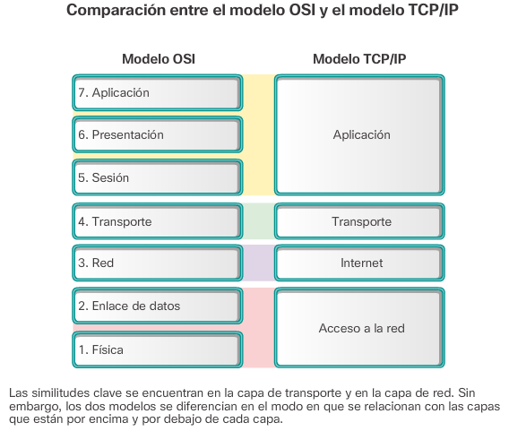
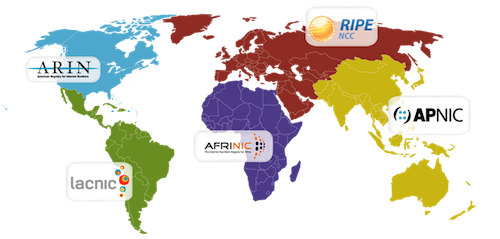
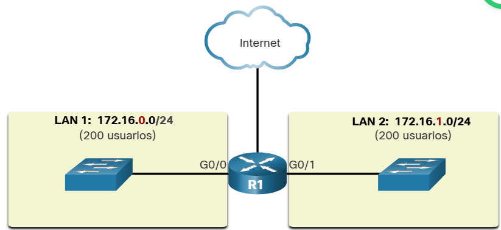
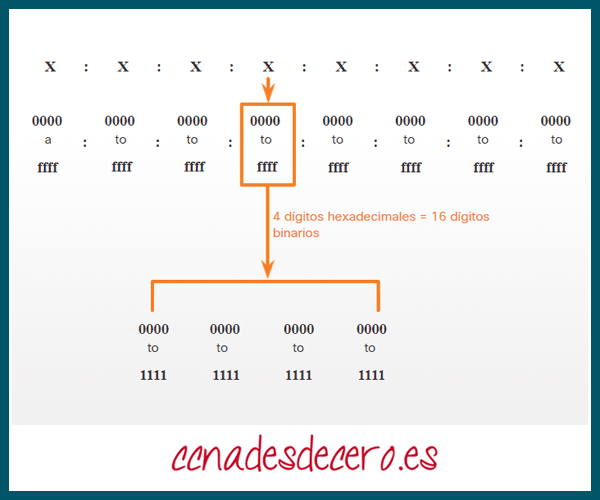
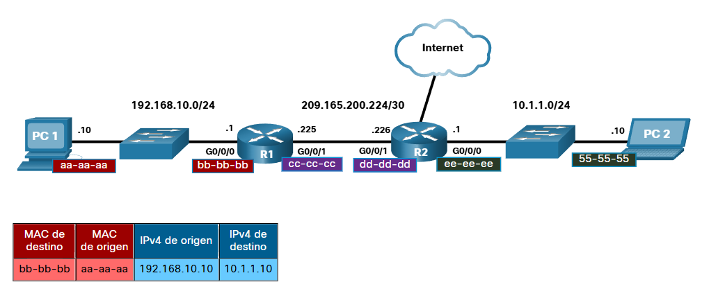
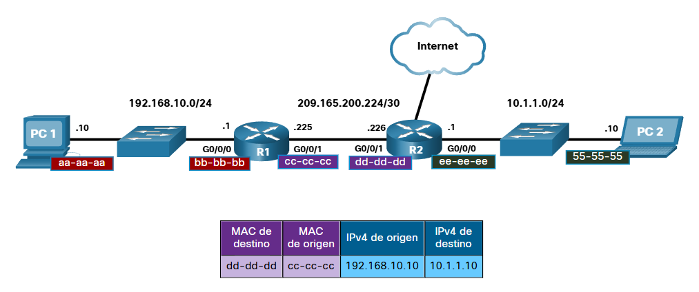
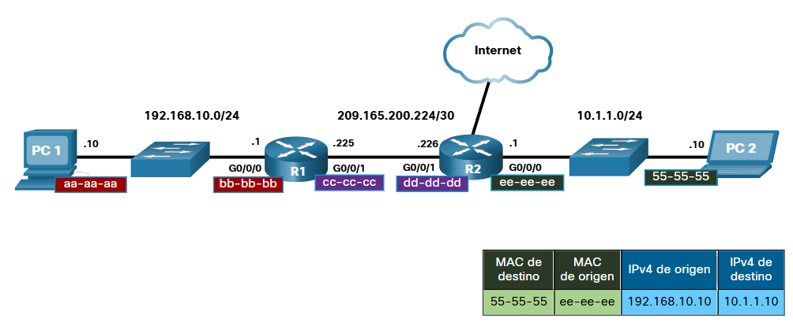
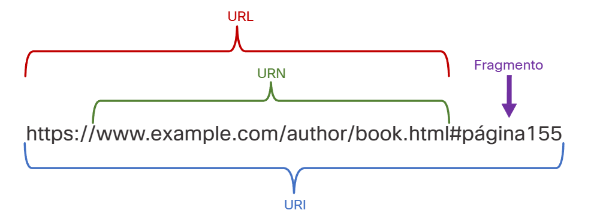
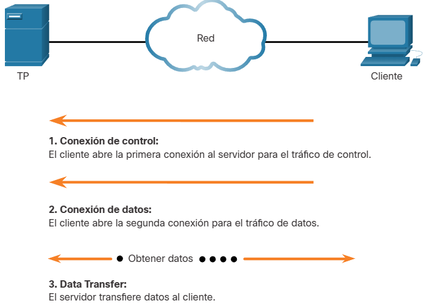

# Networking Basics

- **Source:** Cisco Networking Basics

## Contenido
- [Networking Basics](#networking-basics)
  - [Contenido](#contenido)
  - [Tipos de redes](#tipos-de-redes)
    - [Redes domésticas pequeñas](#redes-domésticas-pequeñas)
    - [Redes domésticas/de oficinas pequeñas](#redes-domésticasde-oficinas-pequeñas)
    - [Redes Medianas a Grandes](#redes-medianas-a-grandes)
    - [Redes Mundiales](#redes-mundiales)
  - [Transmisión de datos](#transmisión-de-datos)
    - [Tipos de datos](#tipos-de-datos)
    - [El bit](#el-bit)
    - [Métodos comunes de transmisión de datos](#métodos-comunes-de-transmisión-de-datos)
  - [Ancho de Banda](#ancho-de-banda)
    - [Rendimiento](#rendimiento)
  - [Clientes y Servidores](#clientes-y-servidores)
    - [Roles de cliente y servidor](#roles-de-cliente-y-servidor)
    - [Redes entre pares](#redes-entre-pares)
    - [Aplicaciones entre pares](#aplicaciones-entre-pares)
    - [Múltiples roles en la red](#múltiples-roles-en-la-red)
  - [Componentes de red](#componentes-de-red)
    - [Infraestructura de la red](#infraestructura-de-la-red)
    - [Dispositivos Finales](#dispositivos-finales)
    - [Resumen](#resumen)
  - [Opciones de Conectividad al ISP](#opciones-de-conectividad-al-isp)
    - [Servicios del ISP](#servicios-del-isp)
    - [Conexiones de ISP](#conexiones-de-isp)
    - [Conexiones de cable y DSL](#conexiones-de-cable-y-dsl)
  - [Redes Inalámbricas](#redes-inalámbricas)
    - [Tipos de redes inalámbricas](#tipos-de-redes-inalámbricas)
  - [Conectividad de dispositivos móviles](#conectividad-de-dispositivos-móviles)
    - [Dispositivos móviles y Wi-Fi](#dispositivos-móviles-y-wi-fi)
    - [Configurar la conectividad Wi-Fi Móvil](#configurar-la-conectividad-wi-fi-móvil)
  - [Crear una red doméstica](#crear-una-red-doméstica)
    - [Conceptos básicos de redes domésticas](#conceptos-básicos-de-redes-domésticas)
    - [Componentes de una red doméstica](#componentes-de-una-red-doméstica)
    - [Enrutadores de red domésticos típicos](#enrutadores-de-red-domésticos-típicos)
  - [Tecnologías de Red en el hogar](#tecnologías-de-red-en-el-hogar)
    - [Frecuencias Inalámbricas LAN](#frecuencias-inalámbricas-lan)
    - [Tecnologías para redes cableadas](#tecnologías-para-redes-cableadas)
  - [Estándares Inalámbricos](#estándares-inalámbricos)
    - [Redes Wi-Fi](#redes-wi-fi)
    - [Configuración Inalámrbcia](#configuración-inalámrbcia)
  - [Configurar un enrutador doméstico](#configurar-un-enrutador-doméstico)
    - [Configuración inicial](#configuración-inicial)
    - [Consideraciones de diseño](#consideraciones-de-diseño)
      - [¿Cómo se debería llamar la red?](#cómo-se-debería-llamar-la-red)
      - [¿Qué tipos de dispositivos se conectarán a mi red?](#qué-tipos-de-dispositivos-se-conectarán-a-mi-red)
      - [¿Cómo agrego nuevos dispositivos?](#cómo-agrego-nuevos-dispositivos)
  - [Principios de Comunicación](#principios-de-comunicación)
    - [Protocolos de comunicación](#protocolos-de-comunicación)
    - [¿Por Qué importan los protocolos?](#por-qué-importan-los-protocolos)
  - [Estándares de comunicación](#estándares-de-comunicación)
    - [Internet y Estándares](#internet-y-estándares)
    - [Organizaciones de Estándares de red](#organizaciones-de-estándares-de-red)
  - [Modelos de Comunicación de Red](#modelos-de-comunicación-de-red)
    - [Modelo TCP/IP](#modelo-tcpip)
    - [Modelo de Referencia OSI](#modelo-de-referencia-osi)
    - [Comparación del Modelo OSI y el Modelo TCP/IP](#comparación-del-modelo-osi-y-el-modelo-tcpip)
  - [Medios de red](#medios-de-red)
    - [Tres tipos de medios](#tres-tipos-de-medios)
    - [Cables de Red Comunes](#cables-de-red-comunes)
  - [La capa de Acceso](#la-capa-de-acceso)
    - [Encapsulación y la Trama de Ethernet](#encapsulación-y-la-trama-de-ethernet)
    - [Encapsulación](#encapsulación)
  - [Tablas de direcciones MAC](#tablas-de-direcciones-mac)
  - [Protocolo de Internet](#protocolo-de-internet)
    - [Propósito de una dirección IPv4](#propósito-de-una-dirección-ipv4)
    - [Octetos y Notación Decimal con puntos](#octetos-y-notación-decimal-con-puntos)
    - [La Estructura de la dirección IPv4](#la-estructura-de-la-dirección-ipv4)
    - [Redes y Hosts](#redes-y-hosts)
  - [IPv4 y Segmentación de redes](#ipv4-y-segmentación-de-redes)
    - [Unidifusión, difusión y multidifusión de IPv4](#unidifusión-difusión-y-multidifusión-de-ipv4)
    - [Tipos de direcciones IPv4](#tipos-de-direcciones-ipv4)
    - [Enrutamiento a Internet](#enrutamiento-a-internet)
    - [Direcciones IPv4 de uso especial](#direcciones-ipv4-de-uso-especial)
    - [Direccionamiento con clase heredado](#direccionamiento-con-clase-heredado)
    - [Asignación de direcciones IP](#asignación-de-direcciones-ip)
    - [Segmentación de Red](#segmentación-de-red)
    - [Dominios de difusión y segmentación](#dominios-de-difusión-y-segmentación)
    - [Problemas con los dominios de difusión grandes](#problemas-con-los-dominios-de-difusión-grandes)
    - [Comunicaciones entre redes](#comunicaciones-entre-redes)
    - [Razones para la segmentación de redes](#razones-para-la-segmentación-de-redes)
  - [Formatos y Reglas de Direccionamiento IPv6](#formatos-y-reglas-de-direccionamiento-ipv6)
    - [Problemas con IPv4](#problemas-con-ipv4)
    - [Coexistencia de IPv4 e IPv6](#coexistencia-de-ipv4-e-ipv6)
    - [Direccionamiento IPv6](#direccionamiento-ipv6)
  - [Direccionamiento Dinámico con DHCP](#direccionamiento-dinámico-con-dhcp)
    - [Direccionamiento Estático y Dinámico](#direccionamiento-estático-y-dinámico)
      - [Asignación de Direcciones IPv4 Estáticas\*\*](#asignación-de-direcciones-ipv4-estáticas)
      - [Asignación de Direcciones IPv4 Dinámicas\*\*](#asignación-de-direcciones-ipv4-dinámicas)
    - [Servidores DHCP](#servidores-dhcp)
    - [Configuración DHCPv4](#configuración-dhcpv4)
  - [Puertas de enlace a otras redes](#puertas-de-enlace-a-otras-redes)
    - [Límites de red](#límites-de-red)
    - [Routers como puertas de enlace](#routers-como-puertas-de-enlace)
    - [Routers como límites entre redes](#routers-como-límites-entre-redes)
    - [NAT](#nat)
  - [El proceso ARP](#el-proceso-arp)
    - [MAC e IP](#mac-e-ip)
      - [Destino en la misma red](#destino-en-la-misma-red)
      - [Destino en red remota](#destino-en-red-remota)
    - [Contención de Difusiones](#contención-de-difusiones)
      - [Dominios de Difusión](#dominios-de-difusión)
      - [Comunicación de la Capa de Acceso](#comunicación-de-la-capa-de-acceso)
      - [ARP](#arp)
  - [Enrutamiento entre redes](#enrutamiento-entre-redes)
    - [La Necesidad del Enrutamiento](#la-necesidad-del-enrutamiento)
    - [Ahora necesitamos enrutamiento](#ahora-necesitamos-enrutamiento)
      - [Routers](#routers)
    - [La tabla de Enrutamiento](#la-tabla-de-enrutamiento)
    - [Entradas de la tabla Enrutamiento](#entradas-de-la-tabla-enrutamiento)
    - [La puerta de enlace predeterminada](#la-puerta-de-enlace-predeterminada)
    - [Crear una LAN](#crear-una-lan)
      - [Todos los Hosts en un segmento local](#todos-los-hosts-en-un-segmento-local)
      - [Hosts en un segmento remoto](#hosts-en-un-segmento-remoto)
      - [Comandos](#comandos)
  - [TCP UDP](#tcp-udp)
    - [Operación TCP/IP y UDP](#operación-tcpip-y-udp)
    - [Números de Puerto](#números-de-puerto)
    - [Pares de sockets](#pares-de-sockets)
    - [Comando netstat](#comando-netstat)
  - [Servicios de la Capa de Aplicación](#servicios-de-la-capa-de-aplicación)
    - [Relación cliente servidor](#relación-cliente-servidor)
    - [Interacción de servidores web e IP de cliente](#interacción-de-servidores-web-e-ip-de-cliente)
    - [URI, URN, y URL](#uri-urn-y-url)
    - [Servicios de Aplicaciones de Red](#servicios-de-aplicaciones-de-red)
    - [Sistema de Nombres de Dominio *(DNS)*](#sistema-de-nombres-de-dominio-dns)
    - [Comprobar Sintaxis `nslookup`](#comprobar-sintaxis-nslookup)
    - [Clientes y Servidores Web](#clientes-y-servidores-web)
      - [HTTP y HTML](#http-y-html)
    - [Clientes y Servidores FTP](#clientes-y-servidores-ftp)
      - [Protocolo de Transferencia de Archivos](#protocolo-de-transferencia-de-archivos)
      - [Comandos](#comandos-1)
    - [Terminales Virtuales](#terminales-virtuales)
      - [Acceso remoto con Telnet o SSH](#acceso-remoto-con-telnet-o-ssh)
    - [Correo electrónico y Mensajería](#correo-electrónico-y-mensajería)
      - [Clientes y Servidores de Correo Electrónico](#clientes-y-servidores-de-correo-electrónico)
      - [Protocolos de correo electrónico](#protocolos-de-correo-electrónico)
      - [Mensajería de Texto](#mensajería-de-texto)
      - [Llamadas Telefónicas por Internet](#llamadas-telefónicas-por-internet)
  - [Utilidades de Prueba de red](#utilidades-de-prueba-de-red)
    - [Comandos de solución de problemas](#comandos-de-solución-de-problemas)
      - [Comando ipconfig](#comando-ipconfig)
      - [Comando ping](#comando-ping)


## Tipos de redes

- Redes locales, existen de todos los tamaños, desde redes simples, compuestas por dos computadoras, hasta redes que conectan cientos de miles de dispositivos. Las instaladas en oficinas pequeñas, hogares y oficinas domésticas se conocen como redes **SOHO** (Small Office/Home Office). En las empresas es posible usar redes grandes para publicar y vender productos. La comunicación a través de una red normalmente es más eficaz y económica que las formas de comunicación tradicionales, como puede ser el correo estándar o las llamadas telefónicas de larga distancia.
- Las redes empresariales y SOHO con frecuencia proporcionan conexión compartida a internet. Internet considera como la **"red de redes"** porque literalmente es una conexión de múltiples redes locales

### Redes domésticas pequeñas

Las redes domésticas pequeñas conectan algunas computadoras entre sí y a Internet.

### Redes domésticas/de oficinas pequeñas

La red SOHO permite que las computadoras en una oficina hogareña o remota se conecten a una red corporativa o accedan a recursos compartidos centralizados.

### Redes Medianas a Grandes

Las redes medianas a grandes, como las que se utilizan en corporaciones y escuelas, pueden tener muchas ubicaciones con cientos o miles de hosts interconectados

### Redes Mundiales

Internet es una red de redes que conecta cientos de millones de computadoras en todo el mundo.

---

Tambien podemos tener diferentes dispositivos conectados entre si:
- Dispositivos móviles: celulares, tabletas, relojs y gafas inteligentes
- Dispositivos domésticos conectados: sistemas de seguridad, electrodomésticos, televisores y consolas de juegos
- Otros dispositivos: autos, etiquetas **RFID** (Radio Frequency Indication - RFID), sensores y accionadores, y dispositivos médicos

---

[Regresar](#contenido)

## Transmisión de datos

### Tipos de datos

- Datos voluntarios: tu los públicas en internet
- Datos inferidos: dependen de datos voluntarios y observados, resultando en el análisis de los mismos *(ej. puntuación crediticia)*
- Datos observados: dependiendo de tus movimientos y acciones del usuario *(ej. GPS, investigar algo, etc.)*

### El bit

Todo es a punta de bits, y la representación es con **ASCII**, donde cada caracter está representado en **ocho bits**. Los códigos se pueden usar para representar casi cualquier tipo de información en formato digital: datos informáticos, gráficos, fotos, voz, video y música.

### Métodos comunes de transmisión de datos

- Señales eléctricas: La transmisión se realiza representando los datos como pulsos eléctricos que viajan por un cable de cobre.
- Señales ópticas: La transmisión se realiza convirtiendo las señales eléctricas en pulsos de luz.
- Señales inalámbricas: La transmisión se realiza por medio de ondas infrarrojas, de microondas o de radio por el aire.

---

[Regresar](#contenido)

## Ancho de Banda

Para transmitir una pelicula o jugar un juego en modo multijugador, se necesita poder enviar y recibir bits a gran velocidad, un **gran ancho de banda**. Por lo general la velocidad de transferencia de datos se realiza en términos de **ancho de banda y rendimiento**.

> El **ancho de banda** es la capacidad de un medio para transportar datos, el **ancho de banda digital** mide la cantidad de datos que pueden fluir desde un lugar a otro en un periodo de tiempo determinado. 

Las medidas comunes de ancho de banda son las siguientes:
- Miles de bits por segundo **(Kbps)**
- Millones de bits por segundo **(Mbps)**
- Miles de millones de bits por segundo **(Gbps)**

### Rendimiento

Medida de transferencia de bits por los medios durante un periodo determinado, por lo que generalmente no coincide con el ancho de banda ya sea por:
- La cantidad de datos que se envían y reciben por la conexión
- Los tipos de datos que se transmiten
- La latencia creada por la cantidad de dispositivos de red encontrados entre origen y destino

> **Latencia** se refiere a la cantidad de tiempo, incluidas demoras, que les toma a los datos transferirse desde un punto determinado hasta otro

En internet el rendimiento no puede ser mas rapido que el enlace más lento de la ruta desde el dispositivo de origen hasta el destino. Incluso si gran parte de los demas dispositivos tienen un ancho de banda elevado, **solo se necesita un segmento de la ruta con un ancho de banda inferior para disminuir el rendimiento de toda la red**.

- [Test your speed connection](https://www.speedtest.net/es)

> [!TIP]
> Necesitas estar cerca del WiFi para poder probarlo

---

[Regresar](#contenido)

## Clientes y Servidores

### Roles de cliente y servidor

Todas las PC conectadas a una red que participan directamente de las comunicaciones de red se clasifican como hosts.
- Los **hosts** pueden enviar y recibir mensajes a través de la red
- En redes modernas, los hosts pueden actuar como **cliente, servidor o ambos**.
- El software instalado en la PC determina cuál es la función que cumple la PC

**SERVIDORES**

- Son hosts con software instalado que les permite **proporcionar información**.
- Cada servicio requiere un software de servidor independiente *(ej. proporcionar servicios de web a la red)*

**CLIENTES**

- Son hosts con software instalado que les permite **solicitar información y mostrar la información obtenida**. *(ej. navegadores web)*

### Redes entre pares

El software de servidor y cliente normalmente se ejecutan en computadores distintas, pero tambien es posible ejecutarse en una misma computadora. En pequeñas empresas y hogares, muchas PC funcionan como servidores y clientes en la red. Este tipo de red se denomina **red entre pares (Peer-to-Peer - P2P)**

- La red P2P mas simple consta de 2 PC conectadas directamente, entonces actuaran como cliente o servidor según sea necesario.
- Tambien se pueden conectar varias PC para crear una red P2P más grande, esto requiere de un **dispositivo de red**, como un **switch**, para interconectar las computadoras.
- **Desventaja**, el rendimiento de un host puede verse afectado si este actua como cliente y servidor a la vez.
- En redes grandes, es mejor tener servidores dedicados para responder a la gran cantidad de solicitudes de servicio

| Ventajas                                                                                      | Desventajas                                                                                                     |
| --------------------------------------------------------------------------------------------- | --------------------------------------------------------------------------------------------------------------- |
| Fácil de configurar                                                                           | La administración no esta centralizada                                                                          |
| Menos complejo                                                                                | No son tan seguras                                                                                              |
| Menor costo porque es posible que no se necesiten dispositivos de red ni servidores dedicados | No son escalables                                                                                               |
| Se pueden utilizar para tareas sencillas como transferir archivos y compartir impresoras      | Todos los dispositivos pueden funcionar como clientes y como servidores, lo que puede lentificar el rendimiento |

### Aplicaciones entre pares

- Las aplicaciones P2P requieren que cada terminal proporcione una **interfaz de usuario y ejecute un servicio en segundo plano**.

> [!NOTE]
> Algunas aplicaciones P2P utilizan un **sistema híbrido** donde se **descentraliza el intercambio de recursos**, pero los **índices** que apuntan a las ubicaciones de los recursos **están almacenados en un directorio centralizado**. En un sistema híbrido, cada punto accede a un servidor de índice para obtener la ubicación de un recurso almacenado en otro punto.

### Múltiples roles en la red

Dependiendo del negocio y función
- Servidor de correo electrónico
- Servidor de Web
- Servidor de Archivos
- Cliente de acceso a archivos
- Explorador Web
- Cliente de correo electrónico
- etc

---

[Regresar](#contenido)

## Componentes de red

### Infraestructura de la red

Contiente tres categorías de componentes de hardware:
- Dispositivos finales:
  - Desktop
  - Laptop
  - Impresora
  - Tablet
  - ETC
- Dispositivos intermedios:
  - Router Inalámbrico
  - Switch LAN *(Local Area Network)*
  - Router
  - Switch Multicapa
  - Dispositivos de firewall
- Medios de red:
  - Medios inalámbricos
  - Medios LAN 
  - Medios WAN *(Wide Area Network)*

### Dispositivos Finales

Un dispositivo final (o host) es el origen o el destino de un mensaje transmitido a través de la red, tal como se muestra en la animación. Para identificar los hosts de forma exclusiva, se usan direcciones. Cuando un host inicia la comunicación, utiliza la dirección del host de destino para especificar a dónde se debe enviar el mensaje.

### Resumen

- 🖧 **Tipos de redes:**
  - **LAN:** Red pequeña que conecta dispositivos dentro de un mismo lugar, como una casa u oficina.
  - **MAN:** Red que conecta varias LAN dentro de una misma ciudad o campus.
  - **WAN:** Red que une redes a grandes distancias, incluso entre países.
  - **Internet:** La red mundial que conecta millones de dispositivos en todo el planeta.
- ⚙️ **Elementos básicos:**
  - **Router:** Conecta redes diferentes y dirige los datos hacia su destino.
  - **Switch:** Conecta varios dispositivos dentro de una misma red local.
  - **Firewall:** Protege la red controlando el tráfico y bloqueando accesos no autorizados.
  - **Servidor:** Ofrece servicios o recursos a otros equipos de la red.
  - **Cliente:** Solicita y utiliza los servicios que ofrece un servidor.

---

[Regresar](#contenido)

## Opciones de Conectividad al ISP

> **ISP** Proveedor de servicios de Internet

### Servicios del ISP

La ISP constituye el eslabón entre la red doméstica y la Internet. Puede ser:
- El proveedor de cable local
- El proveedor de telefonía fija
- La red celular 
- Proveedor independiente que alquila el ancho de banda en la infraestructura de red física de otra empresa

Muchos ISP ofrecen servicios adicionales a sus suscriptores:
- Cuentas de correo electrónico
- Almacenamiento de red
- Hosting de servicios web
- Backups

Cada ISP se conecta a otros ISP para formar una red de enlaces que interconectan usuarios en todo el mundo. Los ISP se organizan **jerarquicamente**, por lo que se garantiza que el tráfico de internet generalmente tome el **camino más corto** desde el origen hasta el destino.

> [!NOTE]
> La red troncal es la autopista que usan los ISP para conectar toda internet, usando cables de fibra optica bajo tierra en ciudades o bajo el mar para conectar continentes, paises y ciudades.

### Conexiones de ISP

- Se puede conectar directamente con el **modem** al ISP, pero esta opción no es segura
- Para tener seguridad se usa un **router** entre el usuario y el modem, este **incluye un switch** y asi conectarse de manera segura al ISP
  - Proporciona switch para hosts cableados
  - AP inalámbrico para hosts inalámbricos
  - Información de direccionamiento IP del cliente
  - Seguridad para los hosts internos

### Conexiones de cable y DSL

La mayoría de los usuarios de redes domésticas no se conectan a sus proveedores de servicios con cables de fibra óptica. En la figura se ilustran opciones de conexión comunes para oficinas pequeñas y usuarios residenciales. Los dos métodos más comunes son los siguientes:
- **CABLE:**
  -  Por lo general, es un servicio ofrecido por proveedores de servicios de televisión por cable.
  -  La señal de datos de Internet se transmite a través del mismo cable coaxial que transporta la señal de televisión por cable. 
     -  Esta opción proporciona una conexión a Internet **siempre activa y de un ancho de banda elevado**. 
  -  Se utiliza un **módem por cable especial que separa la señal de datos** de Internet de las otras señales que transporta el cable y proporciona una conexión Ethernet a un equipo host o a una LAN.
- **DSL (Linea de Suscriptor Digital):**
  - Proporciona una conexión a Internet siempre activa y de un ancho de banda elevado. 
  - Requiere un módem de alta velocidad especial que separa la señal DSL de la señal telefónica y proporciona una conexión Ethernet a un equipo host o a una LAN.
  - Se transmite a través de una línea telefónica, que está dividida en tres canales. 
    - Uno de los canales se utiliza para llamadas **telefónicas de voz**. Este canal permite que una persona reciba llamadas telefónicas sin desconectarse de Internet. 
    - El segundo es un canal de **descarga más rápido y se utiliza para recibir información de Internet**. 
    - El tercer canal se utiliza para **enviar o subir información**.

Tambien estan:
- **Red Celular**
- **Satelital**: costosa *(actualmente)*
- **Telefonía por dial-up**: la mas lenta 😢

---

[Regresar](#contenido)

## Redes Inalámbricas

### Tipos de redes inalámbricas

- **WiFi:** Los transmisores y receptores Wi-Fi ubicados dentro del teléfono inteligente permiten que el teléfono se conecte a redes locales e Internet.
- Celular provider network. *(Funciona hasta 0.18 millas)*
- **Bluetooth:** Bluetooth es una tecnología inalámbrica de corto alcance y baja potencia que tiene como objetivo reemplazar a la conectividad cableada en el caso de accesorios como altavoces, auriculares y micrófonos. Bluetooth también se puede utilizar para conectar un reloj inteligente a un teléfono inteligente. Su conexión se denomina **anclaje de red** *(Funciona hasta 0.05 millas)*
- Near-field communication **(NFC)**: short distance *(ej. paying with your card)*. La Comunicación de Campo Cercano (NFC) es una tecnología de comunicación inalámbrica que permite intercambiar datos entre dispositivos que están muy cerca entre sí, generalmente menos de algunos centímetros.
- **GPS signals:** El GPS utiliza satélites para transmitir señales que cubren el globo. El teléfono inteligente puede recibir estas señales y calcular la ubicación del teléfono con una precisión de 10 metros. *(global)*

> [!NOTE]
> El tipo más común de red de celular es **GSM**. Las abreviaturas 3G, 4G, 4G-LTE y 5G se utilizan para describir **redes de celular mejoradas** que estan optimizadas para la transmisión rapida de datos.
---

[Regresar](#contenido)

## Conectividad de dispositivos móviles

### Dispositivos móviles y Wi-Fi

- WiFi utiliza menos energía que las de datos móviles, conectarse a redes WiFi ahorra la energía de la batería.
- Precauciones que se deben tomar para proteger las comunicaciones por WiFi en los dispositivos móviles:
  - **No enviar** información de inicio de sesión **sin encriptar**
  - Use una conexión **VPN** siempre que envíe datos confidenciales
  - Habilite la seguridad en **redes domésticas**
  - Utilice **WPA2** o un cifrado superior para mayor seguridad


### Configurar la conectividad Wi-Fi Móvil

- Si su dispositivo móvil no solicita conectarse a una red WiFi, es posible que la **difusión del SSID de la red esté desactivada**, o que el dispositivo no esté configurado para conectarse de manera automática.
- Establezca de modo manual la configuración de la conexión WiFi del dispositivo móvil
- Recuerde que los SSID y las frases de contraseña se deben escribir exactamente igual que en la configuración del enrutador inalámbrico

> **SSID** es el nombre asignado a una red inalámbrica *(Identificador de conjunto de servicios)*

---

[Regresar](#contenido)

## Crear una red doméstica

### Conceptos básicos de redes domésticas

Equipos:
- 2 redes:
  - Pública: del proveedor del servicio *(cable o DSL)*
  - Local: cableada o inalámbrica
- Modem: convierte la señal que viene del proveedor
- Algunos router vienen con el modem integrado
  - Casi todos proveen conexión inalámbrica
  - Puerto para conectarle el internet del proveedor
  - Puertos LAN *(switch)*

### Componentes de una red doméstica

Ademas de un enrutador integrado, muchos dispositivos podrían conectarse a una red doméstica:
- PC
- Consola
- SmartTV
- Impresora
- Escáneres
- Cámaras de seguridad
- Teléfonos
- Dispositivos de control del clima

> Red de Area local inalámbrica (WLAN) Doméstica

### Enrutadores de red domésticos típicos

- **Puertos Ethernet:** Etiquetados como ethernet o LAN. Se conectan en la parte del **switch**
- **Puertos de Internet:** Usado para acceder a Internet mediante cable o DSL

> [!NOTE]
> Algunos incluyen antena de radio y acceso inalámbrico integrado

---

[Regresar](#contenido)

## Tecnologías de Red en el hogar

### Frecuencias Inalámbricas LAN

Las tecnologías usadas con más frecuencia se encuentran en rangos de **2.4GHz a 5GHz**:
- Bluetooth utiliza 2.4GHz
- WiFi usa 2.4-5 GHz
- teléfonos inalámbricos usan ~900 MHz
- LAN va de acuerdo a los estandares **IEEE 802.11** que tienen más potencia, permitiendo un mayor alcance y mejor rendimiento

### Tecnologías para redes cableadas

Protocolo cableado mas común es el **protocolo Ethernet**, permite que se comuniquen los dispositivos a traves de una red LAN cableada.
- **cable categoría 5e:** más comun en LAN. consta de 4 pares de hilos trenzados para reducir la interferencia eléctrica
- **cable coaxial:** tiene un alambre interno rodeado por una capa aislante tubular, que luego está rodeada por un blindaje conductor tubular. La mayoria tambien tienen un revestimiento aislante externo
- **cable de fibra óptica:** puede ser de vidrio o plástico con un diámetro similar al de un cabello humano y puede **transmitir información digital a velocidades muy rápidas** a traves de grandes distancias. Tienen un **ancho de banda muy alto**, lo que permite el paso de grandes cantidades de datos

---

[Regresar](#contenido)

## Estándares Inalámbricos

### Redes Wi-Fi

La principal organización responsable de la creación de estándares técnicos inalámbricos es el Instituto de Ingenieros Eléctricos y Electrónicos (IEEE).
- El estandar **IEEE 802.11** rige el entorno **WLAN**
- La **WiFi Alliance** es responsable de probar los dispositivos **LAN inalámbricos** de distintos fabricantes
  - El **logo WiFi** significa que ese equipo cumple con los estándares y debería interoperar con otros dispositivos del mismo estándar

### Configuración Inalámrbcia

Configuración básica en el **Packet Tracer**

> **SSID** Service Set Identifier. Es una cadena alfanúmerica de hasta 32 caracteres. Se envía en todas las tramas transmitidas por la WLAN. Informa a los dispositivos y las estaciones inalámbricas **(STA)** a que red WLAN pertenecen

- **Modo de red**: Determina el tipo de tecnología que debe admitirse, ejemplo: 802.11b. 802.11g, 802.11n
- **Nombre de la red (SSID)**: Utilizado para identificar la WLAN. Todos los dispositivos que deseen participar en la WLAN deben tener el mismo SSID
- **Canal estándar**: Especifica el canal en el que se llevará a cabo la comunicación. La configuración predeterminada esta establecida en **auto** para permitir que el **AP** determine el canal óptimo para usar
- **Difusión de SSID**: Determina si el SSID se transmitirá a todos los disposiivos dentro del alcance. De manera predeterminada está **Activado**

---

[Regresar](#contenido)

## Configurar un enrutador doméstico

### Configuración inicial

Estas utilidades suelen requieren una **PC o computadora portátil conectada a un puerto cableado en el enrutador**. Si no hay ningún dispositivo disponible con una conexión cableada, puede ser necesario primero configurar el software de cliente inalámbrico en la computadora portátil o tableta.
- Para conectarse al enrutador mediante una conexión cableada, conecte un cable de conexión Ethernet al puerto de red de la computadora. Conecte el otro extremo a un puerto LAN del router. No conecte el cable al puerto o a la interfaz con la etiqueta de “Internet”.
- Después de confirmar que la computadora está conectada al router de la red y de que se enciendan las luces de enlace de la NIC para indicar que la conexión está funcionando, la computadora necesita una dirección IP.
  - La mayoría de los enrutadores de red se configuran de modo que la computadora reciba una dirección IP automáticamente de un servidor DHCP local
  - Si la computadora no tiene una dirección IP, consulte la documentación del router y configure la PC o la tableta con una dirección IP única, una máscara de subred, una puerta de enlace predeterminada e información de DNS.

### Consideraciones de diseño

#### ¿Cómo se debería llamar la red?

- No se recomienda incluir modelo ni marca del dispositivo en el SSID

#### ¿Qué tipos de dispositivos se conectarán a mi red?

Los dispositivos inalámbricos contienen transmisor/receptores de radio que funcionan dentro de un rango de frecuencias específico. Si un dispositivo solo tiene la radio necesaria para 802.11 b/g, no se conectará si el enrutador o punto de acceso inalámbricos están configurados para admitir solo los estándares 802.11n u 802.11ac. Si todos los dispositivos admiten el mismo estándar, la red funcionará a su velocidad óptima. Si tiene dispositivos que no son compatibles con los estándares n o ac, deberá habilitar el modo heredado. Un entorno de red inalámbrica de modo heredado **(Legacy)** varía según el modelo de enrutador, pero puede incluir una combinación de 802.11a, 802.11b, 802.11g, 802.11n y 802.11ac. Este entorno proporciona un acceso sencillo a dispositivos antiguos que requieran conexión inalámbrica.

#### ¿Cómo agrego nuevos dispositivos?

La decisión respecto de quién puede acceder a su red doméstica debe tomarse según cómo planee usar la red. En algunos enrutadores inalámbricos, es posible configurar el acceso de invitados. Se trata de un área de cobertura de SSID especial que permite el acceso abierto, pero restringe dicho acceso a usar Internet solamente

> **Filtrado MAC**: medida de seguridad de red que permite o bloquea el acceso de dispositivos a una red según su dirección MAC única

---

[Regresar](#contenido)

## Principios de Comunicación

### Protocolos de comunicación

Protocolos que rigen las comunicaciones humanas:
- Un emisor y un receptor identificados
- Método de comunicación acordado *(en persona, teléfono, carta, fotografía)*
- Idioma y gramática común
- Velocidad y momento de entrega
- Requisitos de confirmación o acuse de recibo

En la red, estas tecnicas se comparten.

### ¿Por Qué importan los protocolos?

- Comunicación sin inconvenientes
- Permite una comuniación global *(podernos comunicar hasta en la China)*

Caracteristicas de los protocolos de red:

| Características de los protocolos | Descripción                                                                                                                                                                                                                                                |
| --------------------------------- | ---------------------------------------------------------------------------------------------------------------------------------------------------------------------------------------------------------------------------------------------------------- |
| Formato del mensaje               | formato o estructura específico, dependen del tipo de mensaje y el canal de envío del mensaje                                                                                                                                                              |
| Tamaño del mensaje                | Varian de acuerdo al canal utilizado, cuando se envía un mensaje muy largo, suele ser necesario particionarlo para enviarlo                                                                                                                                |
| Sincronización                    | Determinan la velocidad a la que se transmiten los bits a traves de la red                                                                                                                                                                                 |
| Codificación                      | El host emisor, primero convierte en bits los mensajes, cada bit **codifica** un patrón de sonidos, ondas de luz o impulsos electrónicos, según el medio de transporte. El host de destino recibe y **decodifica** las señales para interpretar el mensaje |
| Encapsulamiento                   | Cada mensaje debe incluir un **encabezado** que contenga info. de asignación de direcciones que identifique los hosts de origen y destino                                                                                                                  |
| Patrón del mensaje                | Algunos mensajes requieren **confirmación de recepción** para poder enviar el siguiente mensaje, es común en muchos protocolos, sin embargo, *hay otros tipos de mensajes que pueden simplemente enviarse sin preocuparse si llegan al destino*            |

---

[Regresar](#contenido)

## Estándares de comunicación

### Internet y Estándares

- Los estándares de red e Internet aseguran que todos los dispositivos que se conectan a la red implementen el mismo conjunto de reglas o protocolos del mismo modo

> Si una persona envía un correo electrónico a través de una computadora personal, otra persona puede utilizar un teléfono celular para recibir y leer ese correo siempre que el teléfono utilice los mismo estándares.

### Organizaciones de Estándares de red

Cuando se propone un nuevo estándar, cada etapa del desarrollo y del proceso de aprobación es registrada en un documento numerado de solicitud de comentarios **(RFC, Request for Comments)** para seguir la evolución del estándar. Las **RFC** para los estándares de Internet son publicadas y administradas por el Grupo de Trabajo de Ingeniería de Internet **(Internet Engineering Task Force - IETF).**

Otras organizaciones son:
- **IEEE**
- **IANA** Internet Assigned Numbers Authority
- **IETF**
- **ICANN** Internet Corporation for Assigned Names and Numbers
- **ITU**
- **TIA**

---

[Regresar](#contenido)

## Modelos de Comunicación de Red

Protocolos:
- Ethernet: dentro de la misma red
- IP: garantiza un envío desde mi pc hasta su destino *(asi le toque irse por toda la red buscando el destino)*
- TCP: conjunto de reglas que permite la comunicación entre un cliente (navegador web) y un servidor web para solicitar y obtener recursos como páginas HTML, imágenes y vídeos

### Modelo TCP/IP

Los modelos en capas nos ayudan a ver cómo se integran diversos protocolos para posibilitar las comunicaciones de red, el modelo en capas presenta muchos beneficios:
- Ayuda en el diseño de protocolos
- Fomenta la competencia, ya que los productos de distintos proveedores pueden trabajar en conjunto
- Hace posible que se implementen cambios tecnológicos en un nivel sin afectar a los demás niveles
- Proporciona un lenguaje común para describir las funciones y capacidades de networking

El primer modelo en capas se creo en **1970** y se conoce como el **modelo de internet**. Define 4 categorías que deben estar presentes para que las comunicaciones sean exitosas

|Capa del modelo TCP/IP|Descripción|
|Aplicación|Representa datos para el usuario más el control de codificación y de diálogo|
|Transporte|Admite la comunicación entre dispositivos a través de diversas redes|
|Internet|Determina el mejor camino a través de una red|
|Acceso a la red|Controla los dispositivos del hardware y los medios que forman la red|

### Modelo de Referencia OSI

Existen 2 modelos para describir las funciones que deben estar presentes para que las comunicaciones de red sean exitosas:
- **Modelo de protocolo**: Contiene estrechamente la estructura de un conjunto de protocolos en particular. Una suite de protocolos incluye el conjunto de protocolos relacionados que generalmente proporcionan toda la funcionalidad requerida para que las personas se comuniquen con la red de datos. El modelo TCP/IP es un modelo de protocolos porque describe las funciones que ocurren en cada capa de protocolos de una suite de TCP/IP
- **Modelo de referencia**: Este tipo de modelo describe **las funciones que se deben completar en una capa en particular**, pero no especifica exactamente cómo se debe realizar una función. Un modelo de referencia no pretende ofrecer un nivel de detalle suficiente para definir en forma precisa la manera en la que cada protocolo debería funcionar en cada capa. El objetivo principal de un modelo de referencia es ayudar a comprender mejor las funciones y los procesos necesarios para las comunicaciones de red.

El modelo de referencia mas conocido fue creado por el proyecto **Interconexión de Sistemas Abiertos** (OSI). Se usa para el diseño de redes de datos, especificamente su funcionamiento y resolución de problemas.

| Capa de modelo OSI  | Descripción                                                                                                                                                                                    |
| ------------------- | ---------------------------------------------------------------------------------------------------------------------------------------------------------------------------------------------- |
| 7 - Aplicación      | Contiene los protocolos utilizados para comunicaciones proceso a proceso                                                                                                                       |
| 6 - Presentación    | Proporciona una representación común de los datos transferidos entre los servicios de la capa de aplicación                                                                                    |
| 5 - Sesión          | Proporciona servicios para la capa de representación para organizar el diálogo y administrar el intercambio de datos                                                                           |
| 4 - Transporte      | Define los servicios a segmentar, transferir y reensamblar los datos para las comunicaciones individuales entre terminales                                                                     |
| 3 - Red             | Proporciona servicios para intercambiar datos individuales en la red entre terminales identificados                                                                                            |
| 2 - Enlace de datos | Describen los métodos para intercambiar tramas de los datos entre dispositivos en un medio común                                                                                               |
| 1 - Física          | Describen medios mecánicos, eléctricos, funcionales y de procedimiento para activar, mantener y desactivar conexiones físicas para una transmisión de bits hacia y desde un dispositivo de red |


### Comparación del Modelo OSI y el Modelo TCP/IP

Debido a que TCP/IP es el conjunto de protocolos en uso para las comunicaciones por Internet, ¿por qué también necesitamos aprender el modelo OSI?

El modelo TCP/IP es un método para visualizar las interacciones de los diversos protocolos que conforman el conjunto de protocolos TCP/IP. No describe las funciones generales necesarias para todas las comunicaciones de red. Describe las funciones de red específicas de los protocolos en uso en el conjunto de protocolos TCP/IP. Por ejemplo, en la capa de acceso a la red, la suite de protocolos TCP/IP no especifica los protocolos que se deben utilizar para transmitir a través de un medio físico, ni el método de codificación de las señales para la transmisión. Las capas 1 y 2 de OSI tratan los procedimientos necesarios para acceder a los medios y las maneras físicas de enviar datos por la red.

Los protocolos que forman la suite de protocolos TCP/IP pueden describirse en términos del modelo de referencia OSI. Las funciones que se producen en la capa de Internet del modelo TCP/IP se incluyen en la capa de red del modelo OSI, tal como se indica en la figura. La funcionalidad de la capa de transporte es la misma en ambos modelos. Sin embargo, la capa de acceso a la red y la capa de aplicaciones del modelo TCP/IP se dividen a su vez en el modelo OSI para describir funciones discretas que deben realizarse en estas capas.



Las similitudes clave se encuentran en la capa de transporte y en la capa de red. Sin embargo, los dos modelos se diferencian en el modo en que se relacionan con las capas que están por encima y por debajo de cada capa.

- La capa 3 de OSI, la capa de red, asigna directamente a la capa de Internet TCP/IP. Esta capa se utiliza para describir protocolos que abordan y dirigen mensajes a través de una internetwork.
- La capa 4 de OSI, la capa de transporte, asigna directamente a la capa de transporte TCP/IP. Esta capa describe los servicios y las funciones generales que proporcionan la entrega ordenada y confiable de datos entre los hosts de origen y de destino.
- La capa de aplicación TCP/IP incluye un número de protocolos que proporciona funcionalidad específica a una variedad de aplicaciones de usuario final. Las capas 5, 6 y 7 del modelo OSI se utilizan como referencias para proveedores y desarrolladores de software de aplicación para fabricar productos que funcionan en redes.
- Tanto el modelo TCP/IP como el modelo OSI se utilizan comúnmente en la referencia a protocolos en varias capas. Dado que el modelo OSI separa la capa de enlace de datos de la capa física, se suele utilizan cuando se refiere a esas capas inferiores.

---

[Regresar](#contenido)

## Medios de red

### Tres tipos de medios

Los datos se transmiten a través de una red en los medios. El medio proporciona el canal por el cual viaja el mensaje desde el origen hasta el destino.

Las redes modernas utilizan principalmente tres tipos de medios para interconectar dispositivos, como se muestra en la figura:

- **Hilos metálicos dentro de cables** - Los datos se codifican en impulsos eléctricos.
  - cobre, rj45
- **Fibras de vidrio o plástico (cable de fibra óptica)** - Los datos se codifican como pulsos de luz.
  - son más delgados que los otros, pero tiene mejor rendimiento (mas distancia, no se ven afectados por ondas electromagenticas)
- **Transmisión inalámbrica** - Los datos se codifican a través de la modulación de frecuencias específicas de ondas electromagnéticas.

**Criterios de elección:**
Los cuatro criterios principales para elegir los medios de red son:

- ¿Cuál es la **distancia máxima** en la que el medio puede transportar una señal exitosamente?
- ¿Cuál es el **entorno** en el que se instalarán los medios?
- ¿Cuál es la **cantidad de datos** y a qué velocidad deben transmitirse?
- ¿Cuál es el **costo del medio y de la instalación**?

### Cables de Red Comunes

- **Cable de Par Trenzado**: cableado mas común en redes ethernet, pares se agrupan en pares y se trenzan para **reducir interferencia**.
- **Cable coaxial**: mas común en televisores, diferentes componentes satelitales, **único núcleo de cobre rígido** que conduce la señal, rodeado por una capa aislante, un blindaje metálico trenzado y una funda protectora. *Usado como línea de transmisión de alta frecuencia para transporte de señales de banda ancha*
- **Cable de fibra óptica**: puede ser de **vidrio o plástico** con un diametro similar al de un cabello humano y puede transmitir información digital a velocidades muy rápidas a través de grandes distancias. Al usar luz no se ve afectado por la **interferencia eléctrica**. *útiles en generación imágenes médicas, tratamientos médicos e inspecciones de ingeniería mecánica*. Usado en:
  - redes troncales
  - grandes empresas
  - grandes centros de datos
  - compañias de telefonía

---

[Regresar](#contenido)

## La capa de Acceso

### Encapsulación y la Trama de Ethernet

- **Ethernet** es la tecnología comúnmente más utilizada en redes **LAN**.
- Los dispositivos acceden a la red de area local mediante una **Tarjeta de interfaz de red (NIC)**.
- Cada tarjeta NIC tiene una **dirección única** integrada y permanente, que se conoce como **Dirección de Acceso al Medio (MAC)** *(Media Access Control)*.
- La dirección MAC se usa tanto para el origen como para el destino en una trama de **Ethernet**

**Ethernet Frame**

| Frame                   | bytes   | descripción                                                                     |
| ----------------------- | ------- | ------------------------------------------------------------------------------- |
| Preamble                | 7       | Obtener el NIC en sincronización con los bits                                   |
| Start Frame Delimiter   | 1       | Indica que a partir de ese punto vendra info                                    |
| Destination MAC address | 6       | MAC destino en esa red                                                          |
| Source MAC address      | 6       | MAC fuente en esa red                                                           |
| Length type             | 2       | puede ser la longitud de la info. o el tipo de la info. IPv4 o IPv6             |
| Data                    | 46-1500 | info. encapsulada IPv4 o IPv6, entre otros protocolos                           |
| Frame Check Sequence    | 4       | Usado por el receptor, para verificar errores, asegurarse de que no hay errores |

### Encapsulación

El proceso de colocar el formato al mensaje *(la carta)* dentro de otro proceso de mensaje *(el sobre)* se denomina **encapsulamiento**.

> Cada mensaje de PC se encapsula en un formato en especifico, llamado **trama**, una trama actua como el sobre.

---

[Regresar](#contenido)

## Tablas de direcciones MAC

**¿Cómo el switch construye estas tablas?**

1. Tenemos una serie de MAC Address en cada host *(ej. H1 a H4)*
2. Tenemos que enviar de H1 *(MAC AA-AA)* a H4 *(MAC DD-DD)*
3. H1 envía el frame al switch
4. Lo primero que hace el switch es ver que dirección MAC le llegó
5. Entonces ve el puerto del que le llego, y ve si ese puerto esta ocupado
6. Sino lo llena con la dirección MAC que le llegó
7. Luego mira el MAC destino, y si no la tiene, envía el frame a cada puerto que tenga. *(Si ya las tiene pues no revisa las demas)*
8. Cuando lo reciba una, comparará las direcciones MAC, y si no son iguales ignora el resto del frame y asi sucesivamente.

Y asi va llenando la tabla de direcciones MAC

| Port FA 0/1 | Port FA 0/2 | Port FA 0/3 | Port FA 0/4 |
| ----------- | ----------- | ----------- | ----------- |
| AA-AA       | --          | --          | DD-DD       |


---

[Regresar](#contenido)

## Protocolo de Internet

### Propósito de una dirección IPv4

- Un host **necesita una dirección IPv4** para participar en Internet y en casi todas las **LAN**.
- Identifica a un host en particular
- **Única dentro de la red LAN**
- **Única en el mundo**
- Se asigna una IPv4 a la conexión de la interfaz de red **NIC**.
- Algunos servidores pueden tener mas de una NIC *(Cada NIC tiene su propia IPv4)*
- Los router que proporcionan conexiones tambien tienen su propia dirección IPv4
- Cada paquete que se envía por internet tiene una IPv4 de origen y destino

### Octetos y Notación Decimal con puntos

Las direcciones IPv4 tienen 32 bits de longitud:
- `11010001101001011100100000000001`

Para mayor facilidad de manejo se usa la notación decimal, agrupandose cada 8 bits:
- `11010001.10100101.11001000.00000001`

Sin embargo, puede ser dificil de leer, por lo cual se usa su representación decimal en vez de binaria mejorando la legibilidad y uso:
- `209.165.200.1`

### La Estructura de la dirección IPv4

**¿Cómo sabe el dispositivo que la IP esta en una red diferente?**

Cada red IP tiene su:
- componente de red: primeros 3 digitos *(209.165.200)*
- componente del dispositivo **(host)**: último digito *(1)*

> [!NOTE]
> El componente de dispositivo debe ser único en esa red, y el componente de red debe ser el mismo para todos los componentes de esa LAN

### Redes y Hosts

Entonces tenemos dos componentes en una IPv4, pero ademas tenemos una **Mascara de subred** se usa para identificar la red a la que se esta conectando el host, a modo de ejemplo:

- IPv4 192.168.5.11 y la máscara de subred 255.255.255.0. Entonces los primeros 3 octetos indican la porción de red de la dirección y el último el host. Esto se conoce como **direccionamiento jerárquico**. Entonces los routes solo necesitan conocer como llegar a cada red, en vez de conocer la ubicación del host individualmente.
- Con el direccionamiento IPv4, pueden existir **varias redes lógicas** en una misma red fisica.
- Los hosts que esten en la misma red podran comunicarse entre si, pero **no podran con otra red lógica sin un router**

---

[Regresar](#contenido)

## IPv4 y Segmentación de redes

### Unidifusión, difusión y multidifusión de IPv4

- **Unicast (Unidifusión)**: cuando el destino es *solo un dispositivo*, se origina en *un solo dispositivo*. **Comunicación 1v1**
- **Broadcast (Difusión)**: entonces si tenemos un origen *(ej. 172.16.4.1)* y un destino *(255.255.255.255)*, es una dirección especial que significa que el paquete será enviado a **todos los dispositivos en la red**. *(excepto el de origen)*. Se lo envía tambien al router, pero este **no lo reenvía a otras redes**.

> [!WARNING]
> Se debe limitar el tráfico de difusión para que no afecte negativamente el rendimiento de la red o de los dispositivos, la subdivisión de redes ayuda a mejorar este problema *(los routers)*

- **Multicast (Multidifusión)**: enviar de un *solo dispositivo* a *múltiples destinos seleccionados*.
  - Lo reenvía a todos revisando cual es el destino
  - Cuando los encuentra les entrega el resto de la trama
  - Los protocolos de enrutamiento **OSPF** usan multidifusión, los routers con **OSPF** se comunicaon entre si mediante la dirección reservada **224.0.0.5**

### Tipos de direcciones IPv4

- **IPv4 Públicas**: se enrutan globalmente entre los routers de los ISP
- **IPv4 Privadas**: asignadas a hosts privadas por organizaciones, fueron introducidas con el ingreso de **WWW** por el agotamiento de espacio de direcciones IPv4

> La solución a largo plazo son las IPv6

| Dirección de red y prefijo | Rango de direcciones privadas de RFC 1918 |
| -------------------------- | ----------------------------------------- |
| 10.0.0.0/8                 | 10.0.0.0 a 10.255.255.255                 |
| 172.16.0.0/12              | 172.16.0.0 a 172.31.255.255               |
| 192.168.0.0/16             | 192.168.0.0 a 192.168.255.255             |

> [!NOTE]
> Las direcciones privadas se definen en **RFC 1918** y a veces se denomina espacio de direcciones **RFC 1918**

### Enrutamiento a Internet

- **Traducción de direcciones de red (NAT)**, para utilizar direcciones IP privadas:

La mayoría de redes internas usan IPv4 privadas para dirigirse a otros dispositivos internos *(intranet)*. Sin embargo, estas **no son enrutables** globalmente, para hacerlo se filtran o traducen en una **dirección pública** antes de reenviar un paquete a un ISP. Este proceso se realiza en el **router generalmente**.

### Direcciones IPv4 de uso especial

Existen ciertas direcciones como la de red y de difusión, que no se pueden asignar a los hosts. Entre otras direcciones que no pueden asignarse a lo hosts

- **Direcciones de loopback**: direcciones de bucle invertido *(127.0.0.0/8 o 127.0.0.1 a 127.255.255.254)* se identifican más comúnmente como solo 127.0.0.1. Estas son direcciones especiales utilizadas por un host para **dirigir el tráfico hacia si mismo**. Por ejemplo, comando `ping` se usa comúnmente para probar conexiones a otros hosts. Pero también puede usar el comando `ping` para probar si la configuración de **IP** en su propio dispositivo, como se muestra:

```bash
C:∖Users∖NetAcad> ping 127.0.0.1
Pinging 127.0.0.1 with 32 bytes of data:
Reply from 127.0.0.1: bytes=32 time<1ms TTL=128
Reply from 127.0.0.1: bytes=32 time<1ms TTL=128
Reply from 127.0.0.1: bytes=32 time<1ms TTL=128
Reply from 127.0.0.1: bytes=32 time<1ms TTL=128
Ping statistics for 127.0.0.1:
    Packets: Sent = 4, Received = 4, Lost = 0 (0% loss),
Approximate round trip times in milli-seconds:
    Minimum = 0ms, Maximum = 0ms, Average = 0ms
C:∖Users∖NetAcad> ping 127.1.1.1
Pinging 127.1.1.1 with 32 bytes of data:
Reply from 127.1.1.1: bytes=32 time<1ms TTL=128
Reply from 127.1.1.1: bytes=32 time<1ms TTL=128
Reply from 127.1.1.1: bytes=32 time<1ms TTL=128
Reply from 127.1.1.1: bytes=32 time<1ms TTL=128
Ping statistics for 127.1.1.1:
    Packets: Sent = 4, Received = 4, Lost = 0 (0% loss),
Approximate round trip times in milli-seconds:
    Minimum = 0ms, Maximum = 0ms, Average = 0ms
C:∖Users∖NetAcad>
```

- **Direcciones de enlace local**: direcciones privadas automáticas **(APIPA)** *(169.254.0.0/16 o 169.254.0.1 a 169.254.255.254)*. Las utiliza un cliente de **Windows para autoconfigurarse** en caso de que no pueda obtener un direccionamiento IP a tráves de otros métodos.

---

### Direccionamiento con clase heredado

En **1981**, las direcciones IPv4 se asignaron utilizando un direccionamiento con clase como se define en [RFC 790](https://datatracker.ietf.org/doc/html/rfc790) dividiendo los rangos de unidifusión en las siguientes clases específicas:
- **Clase A (0.0.0.0/8 a 127.0.0.0/8)**: diseñada para admitir **redes extremadamente grandes**, con más de 16 millones de direcciones de host. La clase A utilizó un prefijo fijo **/ 8** con el primer octeto para indicar la *dirección de red y los tres octetos restantes* para las direcciones de host *(más de 16 millones de direcciones de host por red)*.
- **Clase B (128.0.0.0/16 a 191.255.0.0/16)**: diseñada para satisfacer las necesidades de redes de **tamaño moderado a grande**, con hasta 65,000 direcciones de host. La clase B utilizó un prefijo fijo **/ 16** con los dos octetos de alto orden para indicar *la dirección de red y los dos octetos restantes* para las direcciones de host *(más de 65,000 direcciones de host por red)*.
- **Clase C (192.0.0.0/24 a 223.255.255.0/24)**: diseñada para admitir **redes pequeñas con un máximo de 254 hosts**. La clase C utilizó un prefijo fijo **/ 24** con los primeros tres octetos para indicar *la red y el octeto restante* para las direcciones de host *(solo 254 direcciones de host por red)*.

> [!NOTE]
> Tambien existe un bloque de multidifusión clase D que consta de 224.0.0.0 a 239.255.255.255 y un bloque de direcciones experimental clase E que consta de 240.0.0.0 - 255.0.0.0. el **/X numero** indica la cantidad de bits que son de red

A partir de 1990 el direccionamiento por clase quedo obsoleto, reemplazandose por direccionamiento sin clase, **que se usa hoy en día**. Las direcciones IPv4 públicas se asignan en función del número de direcciones que se pueden justificar

### Asignación de direcciones IP

- **Regional Internet Registries**

Las direcciones IPv4 deben ser únicas globalmente. Tanto las IPv4 e IPv6 son administradas por la **Autoridad de Números Asignados a Internet (Internet Assigned Numbers Authority, IANA)**, administra y asigna bloques de direcciones IP a los **Registros Regionales de Internet (RIR)**. Los RIR asignan direcciones IP a los **ISP**, quienes a su vez asignan bloques de direcciones IPv4 a organizaciones e ISP mas pequeños.

> Las organizaciones tambien pueden obtenerlas directamente del RIR



- **AfriNIC** Centro de Información de Redes Africano - Región de África
- **APNIC** Centro de Información de Redes de Asia Pacífico - Región de Asia/Pacífico
- **ARIN** Registro Americano de Números de Internet - Región de América del Norte
- **LACNIC** Registro Regional de Direcciones IP de América Latina y el Caribe - América Latina y algunas islas del Caribe
- **RIPE NCC** Réseaux IP Européens Network Coordination Centre - Europa, Medio Oriente y Asia Central

---

### Segmentación de Red

### Dominios de difusión y segmentación

**Dominios de difusión de segmentos de router**

- En una LAN Ethernet, los dispositivos utilizan difusiones y el Protocolo de resolución de direcciones **(Address Resolution Protocol - ARP)** para localizar otros dispositivos.
- **ARP** envía transmisiones de capa 2 a una dirección IPv4 conocida en la red local para descubrir la dirección MAC asociada. *(capa 2, dentro de la misma LAN)*
- Un host normalmente **adquiere su configuración de dirección IPv4 utilizando el Protocolo de configuración dinámica de host (DHCP)** que envía transmisiones en la red local para localizar un servidor DHCP.
- Los switches propagan las difusiones por todas las interfaces, salvo por aquella en la cual se recibieron
- Los routers no propagan difusiones. Cuando un router recibe una difusión, no la reenvía por otras interfaces.

### Problemas con los dominios de difusión grandes

- Un problema con un dominio de difusión grande es que estos hosts pueden generar **difusiones excesivas y afectar la red** de manera negativa.
- Esto da como resultado operaciones de red lentas debido a la cantidad significativa de tráfico que puede causar, y operaciones de dispositivo lentas

### Comunicaciones entre redes

**La solución es reducir el tamaño de la red para crear dominios de difusión más pequeños** mediante un proceso que se denomina división en subredes. Estos espacios de red más pequeños se denominan subredes. En la figura, los 400 usuarios en LAN 1 con la dirección de red 172.16.0.0 / 16 se han dividido en dos subredes de **200 usuarios cada una: 172.16.0.0 / 24 y 172.16.1.0 / 24**. Las difusiones solo se propagan dentro de los dominios de difusión más pequeños. Por lo tanto, una transmisión en LAN 1 no se propagaría a LAN 2.



### Razones para la segmentación de redes

- La división en subredes disminuye el tráfico de red general y mejora su rendimiento.
- le permite a un administrador implementar políticas de seguridad
  - qué subredes están habilitadas para comunicarse entre sí y cuáles no lo están
- reduce el número de dispositivos afectados por el tráfico de difusión anormal
- problemas de hardware o software o intenciones malintencionadas.

Las redes las puedes dividir por:
- Ubicación
- Grupo o función
- Tipo de dispositivo
- ETC

---

[Regresar](#contenido)

## Formatos y Reglas de Direccionamiento IPv6

### Problemas con IPv4

> Debido a que IPv4 se esta quedando sin direcciones sale IPv6

- IPv6 esta diseñado para ser el suscesor de IPv4
- Tiene un espacio de direcciones de **128 bits**, que proporciona **340 undecillones** posibles direcciones

Ademas incluye mejoras respecto a su predecesor:
- Protocolo de mensajes de control de Internet versión 6 **(ICMPv6)**
  - Resolución de direcciones
  - Configuración automática de direcciones que no se encuentran en **ICMP** para IPv4 **(ICMPv4)**

Fechas de agotamiento de IPv4:
- RIPE NCC (Septiembre 2012)
- APNIC (Junio 2014)
- LACNIC (Abril 2011)
- ARIN (Julio 2015)
- AfriNIC (2020)

Teoricamente IPv4 tiene 4300 millones de direcciones, eso y la combinación con NAT demoró el proceso. Sin embargo, NAT crea latencia y tiene limitaciones en comunicaciones entre pares. Desde entonces las ISP y organizaciones como YouTube, Microsoft, etc. han hecho una transición a IPv6

**Internet of Things IoT**

Actualmente Internet involucra diferentes dispositivos que antes no estaban, como sensores, electrodomésticos, ecosistemas, automóviles, equipos biomédicos, etc. Por lo que la transición a IPv6 fue la solución.

### Coexistencia de IPv4 e IPv6

Actualmente coexisten, pero esta transición ya se esta llevando a cabo. Las técnicas de migración que se usan son:
- **Doble pila (Dual-stack)**: permite que IPv4 e IPv6 **coexistan en el mismo segmento de red**, entonces ejecutan ambos protocolos de manera simultanea. *Conocido como IPv6 Nativo*
- **Tunelización**: método para pasasr un paquete IPv6 a través de una red IPv4. El paquete IPv6 **se encapsula** dentro de un paquete IPv4.
- **Traducción**: la traducción de dirección de redes 64 **(NAT64)** permite que los dispositivos habilitados IPv6 se comuniquen con dispositivos IPv4, mediante una tecnica de traducción similar a NAT.

> [!NOTE]
> La tunelización y traducción **Son solo para transición a IPv6** y solo deben usarse cuando sea necesario. El objetivo debe ser las comunicaciones IPv6 nativas de origen a destino

---

### Direccionamiento IPv6

- Las direcciones IPv6 se representan mediante **números hexadecimales**
- Se usan **segmentos o hextetos de 16 bits**



**Formato preferido**

El formato preferido para escribir una dirección IPv6 es `x: x: x: x: x: x: x: x: x`, donde cada **x** consta de **cuatro valores hexadecimales**, en este caso un hexteto de bits **(16 bits)** o **(4 hexadecimales)**. Entonces con ese formato se puede simplificar la escritura de la representación total de una IPv6:

```txt
2001 : 0db8 : 0000 : 1111 : 0000 : 0000 : 0000: 0200
2001 : 0db8 : 0000 : 00a3 : abcd : 0000 : 0000: 1234
2001 : 0db8 : 000a : 0001 : c012 : 9aff : fe9a: 19ac
2001 : 0db8 : aaaa : 0001 : 0000 : 0000 : 0000: 0000
fe80 : 0000 : 0000 : 0000 : 0123 : 4567 : 89ab: cdef
fe80 : 0000 : 0000 : 0000 : 0000 : 0000 : 0000: 0001
```

**Reglas de formato IPv6** para simplificar

Tenemos esta IPv6 `2001 : 0db8 : acad : a088 : 0000 : 0000 : 7000 : 0123`

1. **Regla 1:** Omitir 0s iniciales *(es decir ceros a la izquierda)*, tendriamos: `2001 : db8 : acad : a088 : 0 : 0 : 7000 : 123`
2. **Regla 2:** Los dos puntos, cualquier cadena contigua de uno o mas de 16 bits de todo ceros puede ser representada po **(::)**: `2001 : db8 : acad : a088 :: 7000 : 123`, se redujo la cadena de 8 ceros. **Solo se puede usar una vez esta regla**, es decir, no se puede usar en dos cadenas al mismo tiempo, ejemplo: `2001:db8:0000:0000:1234:0000:0000:5678` tocaría elegir cual de las dos cadenas simplificar con esta regla. *Simplifica el mas largo*

---

[Regresar](#contenido)

## Direccionamiento Dinámico con DHCP

### Direccionamiento Estático y Dinámico

#### Asignación de Direcciones IPv4 Estáticas**

Con una asignación estática, el administrador de red debe configurar manualmente la información de red para un host. Como mínimo, esto incluye lo siguiente:

- **Dirección IP** - Identifica al host en la red.
- **Máscara de subred** - Se utiliza para identificar la red a la que está conectado el host.
- **Puerta de enlace predeterminada** - Identifica el dispositivo de red que utiliza el host para acceder a Internet o a otra red remota.

Como ventajas:
- Útiles en impresoras
- Servidores
- Dispositivos de red que deben ser accesibles para los clientes de la red
- Mayor control de los recursos de red, pero **introducción de hosts lenta**
- El host solo realiza comprobaciones de errores básicas en la IPv4

> [!IMPORTANT]
> Importante tener una lista precisa de qué direcciones IPv4 se asignan a que dispositivos. Son direcciones permamentes y generalmente no se reutilizan

#### Asignación de Direcciones IPv4 Dinámicas**

En redes locales, es habitual que la población de usuarios cambie frecuentemente. Para cambios tan frecuentes es mejor utilizar asignación de red dinámica, esto se logra a través de un protocolo llamado **Protocolo de Configuración Dinámica de Host (DHCP)**
- DHCP asigna automáticamente la información de direccionamiento
  - IPv4
  - Máscara de subred
  - Puerta de enlace predeterminada
  - Info. de configuración
- Método preferido de asignación en grandes redes, ya que reduce los tiempos de configuración
- Las direcciones **no quedan permanentes**
- Las direcciones **son arrendadas** durante un periodo, si se apaga o desconecta, la **dirección regresa al pool** para volver a utilizarse
- Útil con usuarios moviles

### Servidores DHCP

Cuando llega a un aeropuerto o cafetería con Wi-Fi:
- el cliente DHCP contacta al servidor DHCP
- el servidor DHCP asigna una IPv4 a su dispositivo

Varios tipos de dispositivos **pueden actuar como servidores DHCP**, siempre y cuando ejecuten **software de servicios DHCP**. En redes medianas a grandes, este es un servidor dedicado. En redes domésticas, el servidor DHCP puede estar ubicado en el **ISP** y un host de red doméstica recibe su configuración IPv4 directamente del ISP.

En muchas redes domésticas o empresas pequeñas usan un router y modem:
- El router funciona como cliente DHCP y como servidor.
- El router actua como cliente para recibir IPv4 del ISP
- El router actua como servidor DHCP para los hosts internos de la LAN

---

### Configuración DHCPv4

1. Cliente envia un paquete **DHCP Discover**, buscando por el servidor DHCP *(Paquete Broadcast/Difusión)*
   1. Contiene la dirección MAC FF-FF-FF-FF-FF-FF
   2. Contiene una IPv4 255.255.255.255
2. Normalmente sería el router de la casa, en ambiente grandes puede ser un servidor dedicado
3. El servidor DHCP responde con un paquete **DHCP Offer**
   1. Contiene la IP
   2. Contiene la Máscara de subred
   3. Contiene el gateway por defecto
4. El cliente devuelve un paquete de difusión **DHCP Request** que acepta la oferta
5. El cliente configura su IP con esa información
6. El servidor responde con un paquete **DHCP Pack** de unidifusión, indicandole al host que información tiene.

---

[Regresar](#contenido)

## Puertas de enlace a otras redes

### Límites de red

- **Default Gateway**: ir de una red a otra. *(la puerta pa' hacer eso)*.
  - Es la interfaz del router, llega primero ahí todo.
  - puertas pa' entrar al router
  - si tiene varios routers cada uno tiene su puerta predeterminada*(default gateway)*
  - tienen que estar en la misma LAN

### Routers como puertas de enlace

- El router proporciona una puerta de enlace por la cual los hosts de una red pueden comunicarse con los hosts de diferentes redes. Cada interfaz en un router está conectada a una red separada.
- Cada host debe **utilizar el router** como gateway para acceder a otras redes, esta dirección se conoce como **puerta de enlace predetermianda (default gateway)**
- Cuando un router inalámbrico usa el DHCP, envía automáticamente la gateway a los hosts

### Routers como límites entre redes

- Los hosts locales de un servidor DHCP, se les conoce como **hosts internos** ya que estan en la misma red
- Los routers estan configurados para asignar direcciones privadas a los hosts de la red interna, garantizando que no sea posible acceder a la red interna desde internet
- La dirección de gateway predeterminada suele ser **la primera dirección de host en esa red**
- Muchos ISP usan servidores DHCP para asignar las IPv4 al router. La red del lado de internet se conoce como **red externa**
- El router inalámbrico actúa como límite entre la red local interna y la red de Internet externa.

### NAT

2 tipos de IP privadas y publicas, como enviamos info. a internet? con la NAT

- Una red privada pueda enviar info. a traves de internet
- Router tiene una función que mantiene una tabla, en la cual las redes privadas se representan con una red pública
  - Esta red se le conoce como **redes registradas**

---

[Regresar](#contenido)

## El proceso ARP

### MAC e IP

#### Destino en la misma red

**¿Como la red conoce la dirección MAC de un dispositivo de destino?**

Hay **dos direcciones primarias** asignadas a un dispositivo en una LAN Ethernet:
- **Dirección física (la dirección MAC)**: Se utiliza para las comunicaciones de **NIC a NIC** en la misma red Ethernet.
- **Dirección lógica (la dirección IP)**: Se utiliza para enviar el paquete **desde el dispositivo de origen al dispositivo de destino**. La dirección IP de destino puede estar en la misma red IP que la de origen o una red remota.

Las direcciones físicas de capa 2 *(es decir, las direcciones MAC de Ethernet)* se utilizan para entregar la trama de enlace de datos con el paquete IP encapsulado de una NIC a otra NIC que está en la misma red. Si la dirección IP de destino está en la misma red, la dirección MAC de destino es la del dispositivo de destino.

#### Destino en red remota

Cuando esta en una red remota, la dirección MAC de destino será la dirección de **gateway predeterminada del host (es decir, la interfaz del router).**

> En este caso es como una cadena, primero va al gateway local, de ahi al siguiente gateway (router), y asi hasta llegar al gateway de destino, donde ya el destino será el dispositivo, los datos se van desempaquetando en cada etapa.

**Ejemplo:**



En este ejemplo, PC1 desea enviar un paquete a PC2. PC2 se encuentra en una red remota. Dado que la dirección IPv4 de destino no está en la misma red local que PC1, la dirección MAC de destino es la del gateway predeterminado local en el router.

Los routers examinan la dirección IPv4 de destino para determinar la mejor ruta para reenviar el paquete IPv4. Cuando el router recibe una trama de Ethernet, desencapsula la información de capa 2. Por medio de la dirección IP de destino, determina el dispositivo del siguiente salto y desencapsula el paquete IP en una nueva trama de enlace de datos para la interfaz de salida.

En nuestro ejemplo, R1 ahora encapsularía el paquete con la nueva información de dirección de Capa 2, como se muestra en la figura.



La nueva dirección MAC de destino sería la de la interfaz R2 G0/0/1 y la nueva dirección MAC de origen sería la de la interfaz R1 G0/0/1.

A lo largo de cada enlace de una ruta, un paquete IP se encapsula en una trama. El trama es específico de la tecnología de enlace de datos asociada a ese vínculo, como Ethernet. Si el dispositivo del siguiente salto es el destino final, la dirección MAC de destino será la del NIC de Ethernet del dispositivo, como se muestra en la figura.



¿Cómo se asocian las direcciones IP de los paquetes IP en un flujo de datos con las direcciones MAC en cada enlace a lo largo de la ruta hacia el destino? Para los paquetes IPv4, esto se realiza a través de un proceso llamado **Protocolo de resolución de direcciones (ARP)**. Para los paquetes IPv6, el proceso es **ICMPv6 Neighbor Discovery (ND).**

---

### Contención de Difusiones

#### Dominios de Difusión

- Cuando un host recibe un mensaje **broadcast** lo acepta como si estuviera dirigido a él.
- Los switches reenvían la info dentro de la red. Por eso cuando se tienen varios switches se denomina **dominio de difusión (broadcast)**
- Si existen muchos hosts, pueden afectar el tráfico, por lo que si crece mucho es mejor dividir la red en varias redes, o dominios de difusión, reduciendo la carga sobre los switches

#### Comunicación de la Capa de Acceso

> [!NOTE]
> En una red Ethernet local, **una NIC solo acepta una trama si la dirección de destino es la dirección MAC de difusión** o si corresponde a la dirección MAC de la NIC.

**¿Cómo hace el host emisor para determinar qué dirección MAC de destino debe incluir en la trama?**

El host emisor puede utilizar un protocolo IPv4 llamado **Protocolo de Resolución de Direcciones (Address Resolution Protocol, ARP)** para detectar la dirección MAC de cualquier host en la misma red local. IPv6 usa un método similar conocido como Detección de Vecinos.

#### ARP

¿Cómo lo hace, solo sabiendo la IPv4?

1. Primero mira en su **tabla ARP**, busca la IPv4 de destino
2. Sino encuentra la dirección, envia un **ARP Request de difusión** a traves del switch, esperando una respuesta de la IPv4 de destino. *(El router no la reenvía a otras redes, se mantiene en la LAN)*
3. Va comparando las IPv4 en busca de la de destino
4. La IPv4 de destino devuelve un **ARP Reply unidifusión** con la dirección MAC del dispositivo.
5. Ahora la IPv4 de origen tiene los datos del destino para poder transmitirle mensajes, y los llena en su tabla ARP

> [!NOTE]
> La dirección MAC de destino de difusión Ethernet es `FFFF.FFFF.FFFF` en hexadecimal

---

[Regresar](#contenido)

## Enrutamiento entre redes

### La Necesidad del Enrutamiento

- **División de la red local**

Razones para dividir las redes en componentes mas pequeños:
1. Limitar la cantidad de trafico de difusión
   1. Ya que obliga a los demas hosts a aceptar la difusión y procesarla
   2. Se procede a crear dominios de broadcast mas pequeños
2. Por seguridad, evitar accesos a redes de diferentes departamentos por ejemplo.
3. Dividirlas hace mas facil su armado y desarmado, cuando se mueven por ejemplo, oficinas etc.

- **¿Cómo se dividen?**

Una forma de hacerlo es con el **router**
 1. Permite dividir la red local de internet
 2. De la misma forma podemos crear subredes dentro de la red local, creando redes independientes.

### Ahora necesitamos enrutamiento

- **Paquete IP encapsulado en una trama de Ethernet**

En la mayoría de las situaciones queremos que nuestros dispositivos puedan conectarse más allá de nuestra red local: a otros hogares, a otras empresas y a Internet.:
- Los dispositivos que no están en el segmento de red local se denominan **hosts remotos**.
- Cuando un dispositivo de origen envía un paquete a un dispositivo de destino remoto, se necesita la ayuda de **los routers y del enrutamiento**
- El **enrutamiento** es el proceso de identificación de la **mejor ruta** para llegar a un destino

#### Routers
- Dispositivo de red que conecta varias redes IP de Capa 3.
- En la capa de distribución de red, los routers **dirigen el tráfico** y otras funciones de eficiencia.
- Pueden decodificar y leer mensajes
- Toman su dirección de reenvío según su IP de Capa 3, *a diferencia de los switches que los hacen con la MAC de Capa 2*
- El formato contiene IP de origen, destino y los datos
  - Si no se encuentra, se reenvía
- El router recibe un mensaje, desencapsula la trama Ethernet, lee la IP de destino, determina la mejor ruta, lo vuelve a encapsular y se reenvía

---

### La tabla de Enrutamiento

- **Reenvío de paquetes del router** de una red a otra
1. El origen envía su paquete al default gateway del router
2. El router revisa su tabla de enrutamiento, revisando la **red de destino**

- **Reenvío de paquetes del router** de un equipo a broadcast *(difusión)*
1. Se envía a todos los dispositivos en su red *(mediante el switch)*
2. El router al recibir el paquete, **no lo reenvía** porque es de difusión

### Entradas de la tabla Enrutamiento

- Los routers deben utilizar tablas de enrutamiento a fin de almacenar información.
- Las tablas de enrutamiento no tienen relación con las direcciones de los hosts individuales
- Las tablas de enrutamiento contienen las direcciones de las redes y el mejor camino para llegar a esas redes
- Se pueden incorporar entradas a la tabla de enrutamiento de dos maneras:
  - por actualización dinámica por medio de información recibida de otros enrutadores de la red
  - ser ingresadas manualmente por un administrador de la red
- Si el router no puede determinar a dónde debe reenviar el mensaje, lo descartará
  - Los administradores de red **configuran una ruta predeterminada estática** que se coloca en la tabla de enrutamiento para que no se descarte un paquete debido a que la red de destino no está en la tabla de enrutamiento

### La puerta de enlace predeterminada

- Los **hosts envían mensajes locales** directamente al destino usando **ARP** para conocer su dirección MAC.
- Para **enviar mensajes a redes remotas**, el host usa un **enrutador** (puerta de enlace predeterminada).
- El **paquete IPv4** mantiene la IP del destino final, pero la **trama usa la dirección MAC del enrutador**.
- El host obtiene la **dirección IPv4 del enrutador** mediante la **configuración TCP/IP** (puerta de enlace predeterminada).
- Con esa dirección IPv4, el host usa **ARP** para descubrir la **dirección MAC del enrutador**.
- Todos los hosts de la red local usan **la misma puerta de enlace predeterminada** para comunicarse con redes externas.
- Si la **puerta de enlace predeterminada** está **mal configurada o ausente**, los mensajes hacia redes remotas **no podrán entregarse**.

---

### Crear una LAN

- Suelen usar protocolos Ethernet o inalámbricos
- Admiten velocidades de transmisión de datos altas.

> [!NOTE]
> El término **intranet** se usa a menudo para referirse a una LAN privada que pertenece a una organización y está diseñada para que solo los miembros de la organización, los empleados u otras personas con autorización puedan acceder a ella.

#### Todos los Hosts en un segmento local

**Ventajas de un único segmento local:**

- Apto para redes simples
- Menos complejidad y menor costo de red
- Permite que otros dispositivos "vean" los dispositivos
- Transferencia de datos más rápida; comunicación más directa
- Facilita el acceso de los dispositivos

**Desventajas de un solo segmento local:**

- Todos los hosts están en un dominio de difusión que ocasiona más tráfico en el segmento y puede ralentizar el rendimiento de la red
- Es más difícil implementar QoS *(Quality of Service)*
- Es más difícil implementar seguridad

> [!CAUTION]
> a medida que la red crece, el aumento del tráfico disminuye el rendimiento y la velocidad de la red

#### Hosts en un segmento remoto

> [!IMPORTANT]
> Colocar hosts adicionales en una red remota disminuirá el impacto de las demandas de tráfico. Sin embargo, los hosts de una red no podrán comunicarse con los hosts de la otra red sin el uso del enrutamiento

**Ventajas:**

- Más apropiado para redes más grandes y complejas
- Divide los dominios de difusión y disminuye el tráfico
- Puede mejorar el rendimiento en cada segmento
- Hace las máquinas invisibles para quienes se encuentran en otros segmentos de la red local
- Puede proporcionar más seguridad
- Puede mejorar la organización de la red

**Desventajas:**

- Requiere el uso de enrutamiento (capa de distribución)
- El enrutador puede ralentizar el tráfico entre segmentos
- Más complejidad y gastos (requiere un enrutador)

> [!NOTE]
> Aunque el destino de las solicitudes de ping puede ser adyacente al origen solicitante, si el host tiene una memoria caché ARP vacía, se envía una solicitud ARP que debe ser procesada por cada host en la red. Las entradas de caché ARP se eliminan después de un período de tiempo predeterminado. Con muchos hosts en una red, las transmisiones ARP se emitirán con más frecuencia. Esto requiere que se tomen recursos de la red de debería ser para tráfico relacionado con el trabajo.

#### Comandos

- ipconfig: info de la ip
- ipconfig /all: indo detallada
- arp -a: info de la arp
- arp -d: borro o vacío arp
- tracert: usa ICMP para devolver info de los routers
- tracert url: rastrear destino remoto

---

[Regresar](#contenido)

## TCP UDP

> **TCP**: Transmision Control Protocol
> **UDP**: User Datagram Protocol

### Operación TCP/IP y UDP

- **UDP**:
  - Normalmente usado en streaming o comunicación en tiempo real, funciona bien debido a que no tiene mucha sobrecarga
  - En la capa de transporte, los datos se **dividen en segmentos** y cada uno obtiene **información de los puertos en el encabezado**
  - Cuando se envían no todos van en un orden, algunos pueden tomar otro camino y asi sucesivamente
  - En tiempo real, si perdemos un paquete puede que no lo notemos **si es paquete pequeño**. Esto hace que se tenga un ventaja en cuanto al delay, haciendo mas rapida la comunicación, sin embargo, puede tener ciertas perdidas.
  - *Claro en ciertas aplicaciones puede que no sea muy util perder información, y se requiera completa*
- **TCP**: 
  - A diferencia de UDP contiene un mecanismo que asegura que se **pierdan la menor cantidad posible**, y si se pierden se **retransmite automáticamente**
  - Esto lo hace ya que **en cada division existe un número de secuencia**, en adición a los puertos del encabezado
  - Si se pierden, hace que la ventana de revisión de las secuencias sea mas pequeña, para garantizar un tráfico seguro

### Números de Puerto

- **¿Cómo los puertos de la capa de transporte son usados para identificar conversaciones y aplicaciones, que son destino y fuente de las transmisiones?**

Ejemplo:
- Servidor Web
- FTP
- Mail

---

- Cuando configuramos uno de esos servicios, tambien se le asigna un puerto de la capa de transporte
- Existe unos estandares de puertos que son debajo de **1024**, llamados **Well Known Ports** *(los mas conocidos)*
  - Los servidores web escuchan comunicaciones por el puerto 80
  - Servidor FTP por el puerto 21
  - Servidor Mail 25
  - Automáticamente identificados por los clientes *(navegador web)*
- En el host, los puertos con **TCP/UDP se asignan dinámicamente** por el rango superior a **1024**
  - Si ingresar a tu navegador web y buscas una página
  - El tráfico va a la capa de transporte
  - Busca el puerto 80 en destino y asigna un puerto *(en el host)* de fuente aleatoriamente

> [!NOTE]
> Entonces TCP/UDP nos permite tener multiples aplicaciones abiertas simultaneamente

> [!IMPORTANT]
> Los puertos son asignados y administrados por la **Corporación de Internet para Nombres y Números Asignados (ICANN)**, se dividen en 3 categorías y van del 1 a 65535:
> - **Puertos Conocidos:** Asociados a aplicaciones de *red comunes*, van del **1 a 1023**
> - **Puertos Registrados:** del **1024 a 49151** puertos de *origen y destino*, las organizaciones los registran para aplicaciones especificas, como las aplicaciones *IM*
> - **Puertos Privados:** del **49152 a 65535** usados como *puertos de origen*, usados por cualquier aplicación

> [!NOTE]
> Algunas aplicaciones pueden utilizar TCP y UDP. Por ejemplo, DNS utiliza UDP cuando los clientes envían solicitudes a un servidor DNS. Sin embargo, la comunicación entre dos servidores DNS siempre usa TCP.

### Pares de sockets

- Los puertos de origen y de destino se colocan dentro del segmento.
- Los segmentos se encapsulan dentro de un paquete IP.
- El paquete IP contiene la dirección IP de origen y de destino.
- **Se conoce como socket a la combinación de la dirección IP de origen y el número de puerto de origen, o de la dirección IP de destino y el número de puerto de destino.**
- El socket se **utiliza para identificar el servidor y el servicio** que solicita el cliente. 
  - Un socket de cliente puede ser parecido a esto, donde 1099 representa el número de puerto de origen: `192.168.1.5:1099`
  - El socket en un servidor web puede ser `192.168.1.7:80`
  - Juntos, estos dos sockets se combinan para formar un **par de sockets**: `192.168.1.5:1099, 192.168.1.7:80`
- Los sockets permiten que los diversos procesos que se ejecutan en un cliente se distingan entre sí. También permiten la diferenciación de diferentes conexiones a un proceso de servidor.

### Comando netstat

> Las conexiones TCP no identificadas pueden representar una importante amenaza a la seguridad.

A veces es necesario **conocer las conexiones TCP activas que están abiertas y en ejecución en el host de red**:
- **Netstat** es una utilidad de red importante que puede usarse para *verificar esas conexiones*

```bash
netstat
```

---

[Regresar](#contenido)

## Servicios de la Capa de Aplicación

### Relación cliente servidor

> El término servidor hace referencia a un host que ejecuta una aplicación de software que proporciona información o servicios a otros hosts que están conectados a la red

Un navegador como *Chrome o Firefox* es un ejemplo de software de **cliente**. Ademas que una PC puede ejecutar varias aplicaciones de cliente. Ejemplos de servidores:
- Correo electrónico
- Web
- Archivo

### Interacción de servidores web e IP de cliente

1. Cliente busca la URL *(dominio)* en un navegador web *(ej. www.learnIP.com)*.
2. La URL se transcribe a una dirección IP, antes de enviarse, **ya que las redes manejan son IPs y no nombres de dominios**. Esto se realiza con una **busqueda DNS**
   1. Envia una solicitud al **Sistema de Nombres de dominio (DNS)** para recuperar la IP. *(ej. 172.16.10.50)*
3. Se crea una conexión **TCP** entre el servidor y el cliente. *(ej. fuente 172.168.10.15:5507 destino 172.16.10.15:80 SOCKET)*
4. Cuando el servidor recibe el paquete, pondra la solicitud en el puerto 80
5. Retorna una respuesta *(ej. destino 172.168.10.15:5507 fuente 172.16.10.15:80 SOCKET)* al puerto 5507 en este caso

> [!NOTE]
> Todos los paquetes tendran esos encabezados, entonces podra identificarse facilmente a traves de Internet

### URI, URN, y URL

- Los recursos web y los servicios web, como las **API RESTful**, se identifican mediante un **Identificador Uniforme de Recursos (Uniform Resource Identifier, URI)**
- Un URI es una **cadena de caracteres** que identifica un recurso de red especifico.
- Un URI tiene dos especificaciones:
  - **Nombre uniforme de recurso (URN):** Identifica solo el espacio de nombres del recurso **(página web, documento, imagen, etc.)** sin referencia al protocolo
  - **Localizador uniforme de recursos (URL):** Define la **ubicación de red** de un recurso específico en la red. Las `URL HTTP o HTTPS` se utilizan normalmente con los navegadores web. Otros protocolos como `FTP, SFTP, SSH y otros` pueden usarse como URL. Una URL que usa SFTP podría tener el siguiente aspecto: `sftp://sftp.example.com`
- Estas son las **partes de una URI**, tal y como se muestra en la imagen:
  - **Protocolo/esquema** - HTTPS u otros protocolos como `FTP, SFTP, mailto y NNTP`
  - **Nombre de host** - `www.example.com`
  - **Ruta y nombre de archivo** - `/author/book.html`
  - **Fragmento** - `#página155`



---

### Servicios de Aplicaciones de Red

Tipos de servidores y sus protocolos:

| Protocolo                                      | Descripción                                                                                                                    |
| ---------------------------------------------- | ------------------------------------------------------------------------------------------------------------------------------ |
| Sistema de nombres de dominio **(DNS)**        | *Resuelve nombres de dominio* en direcciones IP para permitir la localización de servicios en la red.                          |
| Secure Shell **(SSH)**                         | Provee *acceso remoto seguro* a servidores y dispositivos de red mediante autenticación y cifrado.                             |
| Simple Mail Transfer Protocol **(SMTP)**       | *Envía correos electrónicos y adjuntos* desde clientes hacia servidores y entre servidores de correo.                          |
| Post Office Protocol **(POP3)**                | Permite que el cliente *recupere correos* desde el servidor, normalmente descargándolos al dispositivo.                        |
| Internet Message Access Protocol **(IMAP)**    | Permite *gestionar y sincronizar* el correo directamente en el servidor desde múltiples dispositivos.                          |
| Dynamic Host Configuration Protocol **(DHCP)** | *Asigna automáticamente direcciones IP* y otros parámetros de red a los dispositivos.                                          |
| Hypertext Transfer Protocol **(HTTP)**         | Usado por los navegadores para *solicitar páginas web* y por servidores web para entregar los archivos del **World Wide Web**. |
| File Transfer Protocol **(FTP)**               | Usado para *transferir archivos* interactivamente entre sistemas.                                                              |

---

### Sistema de Nombres de Dominio *(DNS)*

- La red necesita IPs, entonces cuando solicites un `www.google.com`, el sistema preguntará por su IP
- Preguntará al **servidor DNS** la IP del dominio buscado
- El servidor DNS **retorna la IP** al cliente
- El cliente ahora usa esta IP para contactarse con el servidor web del sitio buscado
- En este caso para usar luego el HTTP para descargar la página web

### Comprobar Sintaxis `nslookup`

- Cuando configura manualmente un dispositivo para conectividad de red, recuerde que también incluye una **dirección de servidor DNS**
- En el caso de las redes domésticas, **DHCP ejecuta esta configuración** en el router doméstico
- Su ISP **proporciona la dirección del servidor DNS** al router de su hogar, y luego utiliza el DHCP para enviar la configuración a todos los dispositivos conectados a su red.

> [!NOTE]
> Puede usar el comando `nslookup` para descubrir las direcciones IP de cualquier nombre de dominio. primero `nslookup` enter, y luego la dirección del dominio

---

### Clientes y Servidores Web

#### HTTP y HTML

- **HyperText Transfer Protocol:** Reglas que dicen como la información es transmitida entre un cliente preguntando por una página web y un servidor web que le envía la página web.
- **HyperText Markup Language:** Lenguage de marcado usada para mostrar páginas web

Entonces como sería un paso a paso?
1. Cliente contacta al servidor DNS
2. El servidor DNS le devuelve la IP
3. El cliente contacta al servidor web mediante la IP usando el puerto 80 *(socket destino)*
4. El servidor devuelve la página al cliente usando el puerto asociado al cliente
5. El navegador despliega o muestra la página

> [!CAUTION]
> El protocolo **HTTP no es un protocolo seguro**; la información podría ser fácilmente interceptada por otros usuarios a medida que los datos se envían a través de la red. Para garantizar la seguridad de los datos, HTTP se puede utilizar con protocolos de transporte seguros. *Las solicitudes de HTTP se envían al puerto 443*. Estas solicitudes utilizan **HTTPS** en la dirección del sitio, en lugar de **HTTP**

> El comando `ping` tambien resuelve el DNS, es decir, si le envío un dominio me muestra la IP

---

### Clientes y Servidores FTP

#### Protocolo de Transferencia de Archivos

- Ademas de los servicios Web, otro servicio que se utiliza comúnmente por medio de Internet es el que permite a **los usuarios transferir archivos**.
- El Protocolo de Transferencia de Archivos **(FTP, File Transfer Protocol)** brinda un método sencillo para **transferir archivos de una computadora a otra**.
- Un host que ejecuta un software cliente **FTP** puede acceder a un servidor **FTP** para realizar diversas funciones:
  - administración de archivos *(inclusive de manera remota)*
  - subir y descargar archivos
  - Para lograr ello usa dos puertos para el **control y datos**

Paso a paso:
1. Para comenzar una sesión FTP, se envían solicitudes de conexión de control al servidor mediante el **puerto 21 TCP** de destino
2. El software cliente FTP viene incorporado en los **sistemas operativos** y en la mayoría de los **exploradores web**
3. Los clientes FTP independientes ofrecen muchas opciones en una interfaz fácil de usar basada en GUI *(ej. FileZila)*



#### Comandos

- **ftp direccion_ip**: conectar a una IP
- **put archivo**: poner un archivo en el servidor FTP
- **rename archivo archivonuevo**: renombrar un archivo
- **get archivo**: descargar archivo del servidor FTP

---

### Terminales Virtuales

#### Acceso remoto con Telnet o SSH

SSH es mas seguro que Telnet

- **Telnet**:
  - Telnet se remonta a principios de la década de los 70 y se encuentra entre los servicios y protocolos de capa de aplicación más antiguo dentro del grupo TCP/IP.
  - Telnet proporciona un método estándar de emulación de dispositivos de terminal con base en texto en la red de datos.
  - Los servidores Telnet escuchan las solicitudes del cliente en el puerto 23 de TCP.
  - Una conexión que utiliza Telnet se llama **sesión de terminal virtual (vty)** o conexión
  - Telnet utiliza software para crear un dispositivo virtual que proporcione las mismas características de una sesión de terminal con acceso a la interfaz de línea de comandos (CLI) del servidor.
  
> [!WARNING]
> Telnet se considera un protocolo no seguro, y se recomienda usar SSH

- **Problemas de usar Telnet**:
  - Si estan autorizados, pueden iniciar sesion y detener procesos, configurar el dispositivo e inclusive apagar el sistema
  - **No admite** el transporte de datos cifrados
  - Todos los datos se transportan como texto normal por la red. *Facilidad de intercepción*

- **SSH**:
  - Proporciona la estructura para un **inicio de sesión remoto seguro y otros servicios de red seguros**
  - Autenticación mejor que Telnet y admite transporte de datos de sesión mediante cifrado

---

### Correo electrónico y Mensajería

#### Clientes y Servidores de Correo Electrónico

- Los servidores de correo electrónico ejecutan software servidor que les permite interactuar con clientes y con otros servidores de correo electrónico mediante la red.
- Cada servidor de correo recibe y almacena correspondencia para los usuarios que tienen buzones configurados en el servidor de correo.
- Cada usuario que tenga un buzón **deberá utilizar entonces un cliente de correo electrónico** para acceder al servidor de correo y leer estos mensajes.
- Muchos sistemas de mensajería de Internet **utilizan un cliente basado en web** para acceder al correo electrónico. Algunos ejemplos de este tipo de cliente son Microsoft 365, Yahoo y Gmail.
- Diversos protocolos de aplicaciones que se usan en el procesamiento del correo electrónico incluyen `SMTP, POP3 e IMAP4`

#### Protocolos de correo electrónico

- **Protocolo Simple de Transferencia de Correo (SMTP):** 
  - SMTP es utilizado por un cliente de correo electrónico para **enviar mensajes a su servidor de correo electrónico local**. El servidor local entonces decide si el mensaje se destina a un buzón local o si se remite a un buzón de otro servidor.
  - Las solicitudes SMTP se envían al **puerto 25.**
-  **Protocolo de oficina de correos (POP3):**
  - Un servidor que admite clientes POP recibe y almacena mensajes dirigidos a sus usuarios.
  - Cuando el cliente se conecta con el servidor de correo electrónico, los mensajes se **descargan al cliente.**
  - De manera predeterminada , **los mensajes no se retienen en el servidor una vez que el cliente accede a ellos.**
  - Los clientes se ponen en contacto con los servidores POP3 en el **puerto 110.**
-  **Protocolo de acceso a mensajes de Internet (IMAP4):**
  - Un servidor que admite el cliente IMAP también recibe y almacena los mensajes dirigidos a sus usuarios.
  - **IMAP conserva los mensajes en los buzones del servidor**, a menos que el usuario los elimine.  
  - La version actual es **IMAP4**
  - Espera las solicitudes del cliente en el **puerto 143.**

#### Mensajería de Texto

- El software de mensajería de texto está integrado en muchas aplicaciones en línea, aplicaciones de teléfonos inteligentes y sitios de redes sociales.
- Los mensajes de texto también pueden denominarse
  - mensajes instantáneos
  - mensajes directos
  - mensajes privados
  - mensajes de chat.
- Por lo general, se accede a los servicios de mensajería de texto en una computadora **a través de un cliente basado en la web** que está integrado en una red social o en un sitio para compartir información.
- También hay varios clientes de mensajes de texto independientes
  - Cisco Webex Teams
  - Microsoft Teams
  - WhatsApp
  - Facebook
  - Messenger
  - muchos otros.
- Además de los mensajes de texto, estos clientes admiten la transferencia de documentos, videos, música y archivos de audio.

#### Llamadas Telefónicas por Internet

- Un cliente de telefonía por Internet utiliza una **tecnología entre pares** similar a la empleada por la mensajería instantánea
- La telefonía IP usa la tecnología de **Voz sobre IP (VoIP)** que convierte las *señales analógicas de voz en datos digitales*
- Una vez instalado el software del teléfono IP, el usuario selecciona un nombre exclusivo. De esta manera, los usuarios pueden recibir llamadas de otros usuarios

---

[Regresar](#contenido)

## Utilidades de Prueba de red

### Comandos de solución de problemas

- **Descripción General de los comandos de solución de problemas**: Existen diversas utilidades que permiten identificar problemas de redes. La mayoría vienen con el sistema operativo como la **interfaz de linea de comandos (CLI)**. Estas son algunas de las utilidades
  - `ipconfig`: Muestra información de la configuración IP
  - `ping`: Prueba las conexiones con otros hosts IP
  - `netstat`: Muestra las conexiones de red
  - `traceart`: Muestra la ruta exacta recorrida hasta el destino
  - `nslookup`: Directamente solicita al servidor de nombres de información sobre un dominio de destino

#### Comando ipconfig

- `ipconfig`: información sobre la configuración IP actual, muestra
  - dirección IP
  - máscara de subred
  - gateway predeterminado
- `/all`: si usamos la bandera *all* muestra información adicional:
  - dirección MAC
  - direcciones IP del gateway predeterminado
  - servidores DNS
  - si DHCP esta activo
  - dirección del DHCP

> [!NOTE]
> **Sin una configuración IP adecuada**, el host no puede participar en comunicaciones por la red. Si el host no conoce la ubicación de los servidores DNS no puede traducir los nombres y convertirlos en direcciones IP.

- `/release y /renew`: Si las direcciones IP son dinámicas, entonces *release* **liberará** los enlaces DHCP actuales. Por otro lado, *renew* solicita información **actualizada** del servidor DHCP

> [!NOTE]
> **Si después de enviar la configuración IP el host no puede obtener información actualizada del servidor DHCP**, es posible que no haya conectividad de red. Verifique que la NIC tenga iluminada una luz de enlace, lo que indica que existe una conexión física con la red. Si esto no soluciona el problema, quizás exista un inconveniente en el servidor DHCP o en las conexiones de red con el servidor DHCP.

#### Comando ping

**Probablemente la utilidad de red más usada sea ping**. La mayoría de los dispositivos habilitados para IP admiten algún tipo de comando ping para probar si los dispositivos de red son accesibles o no a través de la red IP.

> [!NOTE]
> El comando ping puede ir seguido de una **dirección IP o del nombre de un host de destino**. En el ejemplo, el usuario hace ping a la puerta de enlace predeterminada en 10.10.10.1 y luego hace ping a ww w.cisco.com.

- Si el comando ping enviado a la dirección IP funciona, pero el ping enviado al nombre no, **es muy probable que exista un problema con DNS.**
- Si los comandos de ping enviados tanto al nombre como a la dirección IP son exitosos, pero el usuario aún no puede acceder a la aplicación, **lo más probable es que el problema resida en la aplicación en el host de destino.**
- Si no funciona ninguno de los dos comandos ping, es muy probable que el problema sea la conectividad de red en la ruta hacia el destino. De suceder esto, **lo habitual es enviar un comando ping a la puerta de enlace predeterminada.**
  - Si este comando ping funciona correctamente, *el problema no es local.*
  - Si el comando ping enviado a la puerta de enlace predeterminada falla, *entonces el problema reside en la red local.*
- En algunos casos, el ping puede fallar pero la conectividad de red no es el problema. **Un ping puede fallar debido al cortafuegos en el dispositivo emisor o receptor, o un enrutador** en la ruta que está bloqueando los pings.

```bash
C:\> ping
 
Usage: ping [-t] [-a] [-n count] [-l size] [-f] [-i TTL] [-v TOS]
            [-r count] [-s count] [[-j host-list] | [-k host-list]]
            [-w timeout] [-R] [-S srcaddr] [-c compartment] [-p]
            [-4] [-6] target_name
 
Options:
    -t             Ping the specified host until stopped.
                   To see statistics and continue - type Control-Break;
                   To stop - type Control-C.
    -a             Resolve addresses to hostnames.
    -n count       Number of echo requests to send.
    -l size        Send buffer size.
    -f             Set Don't Fragment flag in packet (IPv4-only).
    -i TTL         Time To Live.
    -v TOS         Type Of Service (IPv4-only. This setting has been deprecated
                   and has no effect on the type of service field in the IP
                   Header).
    -r count       Record route for count hops (IPv4-only).
    -s count       Timestamp for count hops (IPv4-only).
    -j host-list   Loose source route along host-list (IPv4-only).
    -k host-list   Strict source route along host-list (IPv4-only).
    -w timeout     Timeout in milliseconds to wait for each reply.
    -R             Use routing header to test reverse route also (IPv6-only).
                   Per RFC 5095 the use of this routing header has been
                   deprecated. Some systems may drop echo requests if
                   deprecated. Some systems may drop echo requests if
    -S srcaddr     Source address to use.
    -c compartment Routing compartment identifier.
    -p             Ping a Hyper-V Network Virtualization provider address.
    -4             Force using IPv4.
    -6             Force using IPv6.
 
C:\>
```

[Regresar](#contenido)